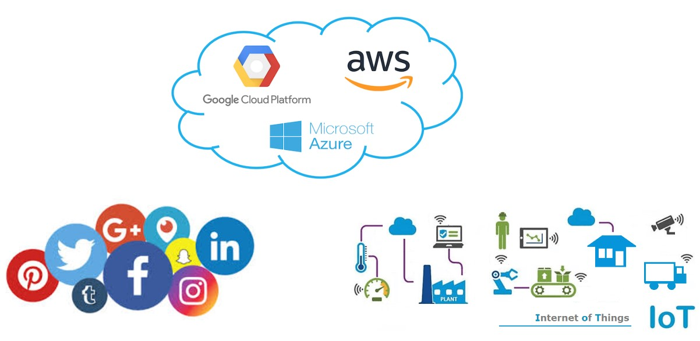
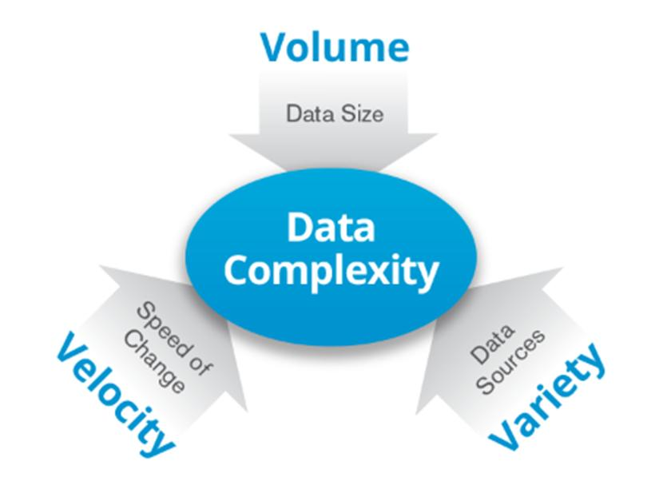
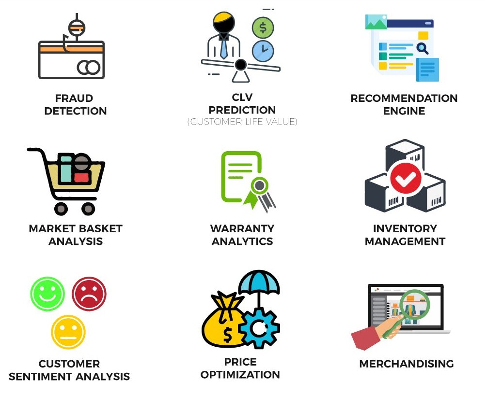
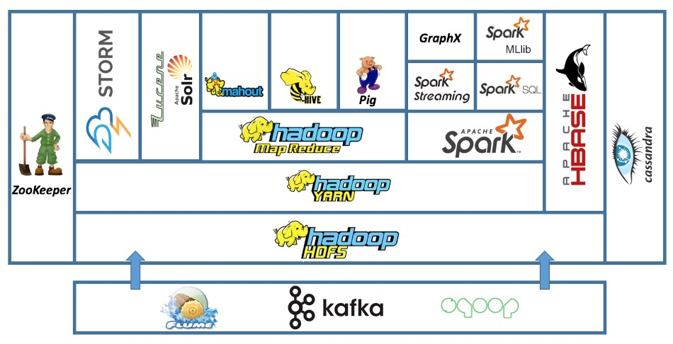
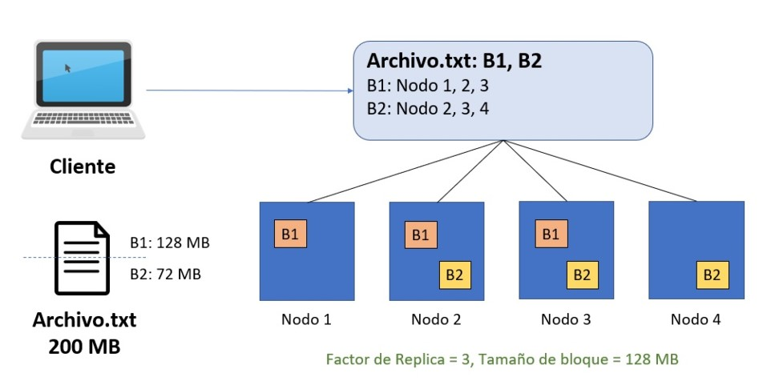
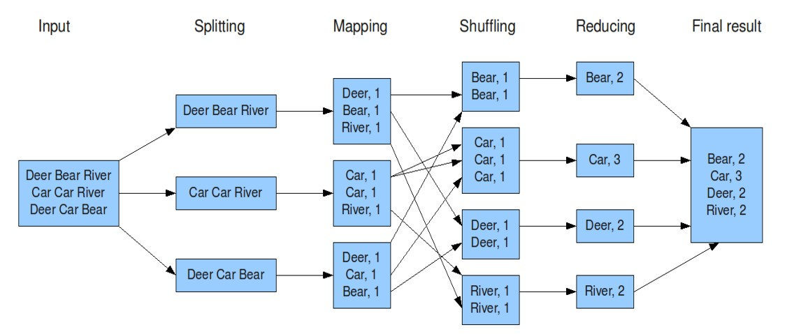

# Notas clase de material complementario

# Big Data
## Vistazo histórico
Antes de que exista la computadora (1950-1960) era necesario llevar una contabilidad, registar datos, por lo que se hacía de forma manual en lapiz y papel.
En la década de 1960 se crearon las primeras computadoras, que permitieron guardar la información en tablas libres, en computadoras locales.
Luego nace la necesidad de automatizar ciertas partes del negocio y almacenar mayor cantidad de datos, de fora más eficiente.
Para poder extraer información de estas tablas, era necesario una persona especializada en la extracción de información básica. Era mucha complejidad.
Luego nace SQL, para hacer más eficiente el guardado de información y su extracción, y ya no se requiere alguien especializado.
Aparece el concepto cliente-servidor, donde puedo guardar la información en una computadora, pero varios clientes pueden acceder a esta.
COon el surgimiento del internet y de las grandes empresas, se comienzan a generar grandes cantidades de datos --> BIG DATA emerge necesidad de estas empresas de manejar la informacion.
Con el surgimiento de más empresas que necesitan manejar grandes cantidades de datos, surgen las empresas especializadas en el almacenamiento y tratamiento de grandes cantidades de datos en la nube.
Ya más adelante, con la aparicion de IoT (el internet de las cosas) la cantidad de datos que se generan son muy grandes, ya que todo genera datos e información

## Las 3Vs de Big data
Big data esta definido con tres Vs:
### Volumen 
Se generan grandes volúmenes de información
### Velocidad
Todo el tiempo se está recibiendo grandes cantidades de información: de aplicaciones, paginas webs, etc.
### Variedad
La información se recibe en diferentes formatos: cvs, json, imagenes, videos, sonidos.

## Casos de uso (overview)
**- Detección de fraude:** mediante estadística y algoritmos identificar cualquier transacción sospechosa que tiene que pasar en tiempo real. Y además definir el "accionable", es decir qué vamos a hacer en base a esta identificación (todo esto ppasa en un ecosistema de big data)
**- Customer life value:** se refiere a al valor que le doy a que un cliente se quede. Por ejemplo, si detecto que alguien se queda mucho tiempo, puedo darle un descuento para fomertar y premiar esa estancia. 
**- Sistema de recomendaciones:** el ejemplo de youtube, que luego de ver un video da recomendaciones. Implica reducir los millones de videos cargados en youtube a los que me pueden interesar como usuario, y hacer esto mismo para los millones de usuarios que utilizan YouTube
**- Market basket analysis:** Esto sirve para recomendar al comprador productos que se venden en combo, para recomendar al comprador. Por ejemplo: una hamburguesa para hacer, con pan de hamburguesa y aderezos. O comida rápida con algun tipo de bebida.
**- Sentiment analysis:** analizar la opinión de los clientes sobre un producto o servicio.
***Entre otros***

## Data Warehouse vs Data Lake
El **Data Warehouse** es un sistema de almacenamiento tiene multiples fuentes de información, cada una puede estar en una base de datos, todas ellas son relacionales, que nos permita realizar soluciones analíticas: que nos permitas realizar análisis, crear modelos, etc. El dato crudo requiere un procesamiento. Esto se realiza antes de almacenarlo en el Data Warehouse (que es un banco de datos que nos permite crear soluciones analiticas). Dado que surge en un momento histórico donde el almacenamiento era costoso, solo se guardan los datos que se van a utilizar.

Hoy en día, cambia el costo de almacenamiento (es muchísimo más economico y con más posibilidades), por lo que nace el concepto de **Data Lake**, donde se almacena inforación, se vaya a utilizar o no.

Entonces, en el **Data WareHouse** el almacenamiento es exclusivamente con fines analíticos, mientras que en el **Data Lake** se almacenan todos los datos crudos (raw data), en el formato original, sin necesidad de procesarla.

La principal ventaja del **Data Lake** es la capacidad de almacenar grandes cantidades de datos, a grandes velocidades, ya que no los procesa/transforma.
El **Data WareHouse** tiene capacidad de almacenar grandes cantidades de información, así como también es capaz de soportar cierto grado de variedad de información. Pero la velocidad no la soporta, no están diseñados para ello.

### Estrategias de procesamiento 
Ante estos dos contextos, hay dos formas de procesar los datos:
En el **Data Lake** se guarda la información directamente desde el origen, de manera cruda, para asegurarnos la velocidad de guardado. Nos ahorramos el tiempo de procesamiento y el hecho de que pueda haber errores de procesamiento.
> Entonces en el **Data Lake**, el procesamiento de la información se da por **ELT --> EXTRACT - LOAD - TRANSFORM**

En cambio, en el **Data Warehouse**, se transforma la información antes de cargarla, para dejarla lista para un fin analítico. Y finalmente se escribe.
> Entonces en el **Data Warehouse**, el procesamiento de la información se da por **ETL --> EXTRACT - TRANSFORM - LOAD**

## Arquitectura del Data Lake
El origen es variado: *bases de datos relaciones, información de la empresa, logs (que surgen de la interacción de componentes de una pagina web, una API), o de servicios de la nube*.
El formato también es variado, desde archivos planos (csv o json), otras bases de datos, hasta streaming, APIs
Primero entran en una zona de cargado transciente donde se guarda la data sin procesar o incluso encriptada.
Luego pasa por distintos estadios: 
    1. Refinamiento (donde se hace algun procesamiento)
    2. Validación (donde se ve que la data sea correcta)
    3. Capa de análisis/descubrimiento
Todas las capaas estan acompañadas de **componentes**:
    - Metadata
    - Calidad de dato (hace validaciones)
    - Data catalog (lista todas las tablas, etc)
    - Seguridad (permisos de acceso)

# Hadoop
Es un sistema open-source diseñado para almacenar y procesar Big Data de forma distribuida utilizando un cluster de servidor --> lo convierte en una alternativa a la arquitectura cliente-servidor (SQL), para manejar Big Data.

No todas las herramientas permiten almacenar y procesar, lo que es importante resaltar en Hadoop.

## Ecosistema Hadoop

### Cluster Hadoop
Arquitectura: tiene una computadora maestro (Active Master) y muchas otras computadoras (Workers).
El master tiene información acerca de cada uno de los workers: memoria, capacidad, etc. Y además puede controlarlos (decide dónde se guarda la información - en qué worker -) Es el encargado de gestionar.
Los workers son los encargados de almacenar y procesar la información
También se cuenta con un Stand by Master, que es una alternativa al master, si este último deja de funcionar ("se cae"), está el reemplazo/respaldo.

Gracias a esta estructura, es que tiene las caracteristas de:
- Tolerancia a los fallos: hay redundancia en la carga (la información se carga por triplicado), por lo que si un worker se cae o deja de funcionar, hay respaldo de esa información en algún otro worker, y el hecho de contar con varios workers, cualquiera puede analizar. Y se cuenta con respaldo del master. 
- La escalabilidad horizontal se refiere a que si en algun momento las necesidades de almacenamiento o procesamiento cambian, es posible agregar más workers. En contraste con SQL, donde la estructura es cliente-servidor, en caso de necesitar mayor capacidad de almacenamiento o procesamiento, es necesario cambiar el servidor por uno más potente/mejor (por lo que la escalabilidad es vertical).
- Commodity hardware: se refiere a que cada nodo no necesita ser un super ordenador, sino que cada uno es "decente", en conjunto me dan una gran capacidad de almacenamiento/procesamiento. Tenerlos en conjunto (CLUSTER) me permite el poder, cada una no necesita ser un super computador.
- Procesamiento en paralelo: permite procesar/almacenar información en cada nodo

### HDFS (Hadoop Distributed File System)
HDFS es sinónimo de almacenamiento en el ecosistema Hadoop
Se tiene en cuenta dos factores:
    **- Tamaño del bloque:** es el tamaño que se le asigna a un bloque.
    **- Factor de replicación:** Cantidad de veces que se va a guardar la misma información en diferentes bloques. No se suele usar más de 3 o 4, para no malgastar espacio.

### YARN (Yet Another Resource Negotiatior)
**Administra recursos** escencialmente.
Hace posible la alta disponibilidad de recursos y permite ejecutar muchas aplicaciones
Es un ***administrador de tareas***

### MapReduce
Utiliza todo HDFS como almacenamiento para procesar. Consulta a HDFS por la información para poder pocersarla.
Siempre sigue los mismos pasos:

