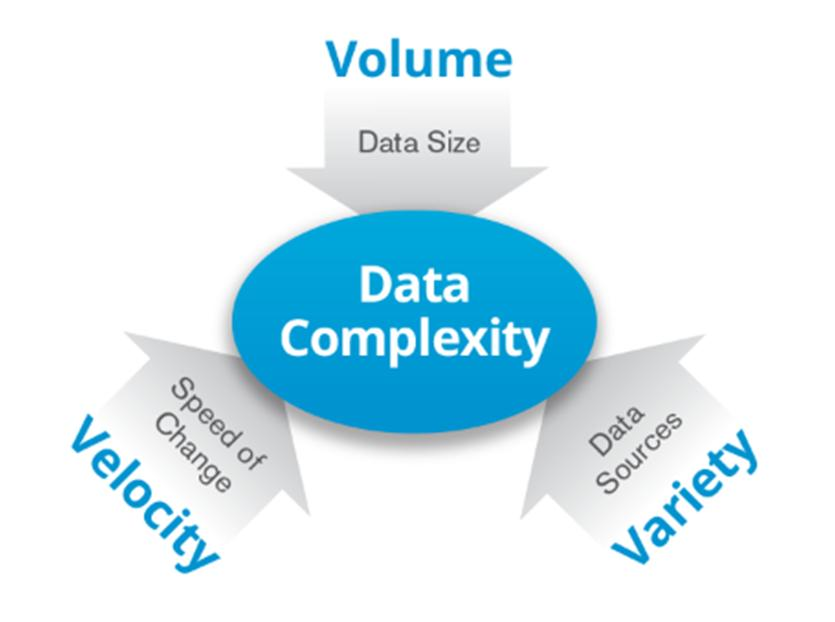

# Big Data
La era de los datos...
> El uso de **sistemas informáticos** para automatizar procesos empresariales se originó en el área militar después de la Segunda Guerra Mundial. En los años **70**, se introdujeron los sistemas MRP para la planificación de la producción. En los años **80**, surgieron los sistemas MRP-II que incluían gestión de recursos económicos. En los años **90**, se acuñó el término ERP, enfocándose en funciones empresariales y evolucionando hacia soluciones modulares avanzadas. A partir del **2000**, los ERP se popularizaron y se agregaron funcionalidades como CRM e inteligencia de negocio. Desde el **2005**, la tendencia se ha orientado hacia soluciones en la nube, permitiendo a las PYMES acceder a estas soluciones a menor costo. El almacenamiento de datos también ha evolucionado, desde archivos binarios hasta el lenguaje SQL en los años 70, con Oracle lanzando su propia versión en **1979**.
>
>
>
> Cuando hablamos de **Big Data** nos referimos a conjuntos de datos o combinaciones de conjuntos de datos cuyo tamaño (volumen), complejidad (variabilidad) y velocidad de crecimiento (velocidad) dificultan su captura, gestión, procesamiento o análisis mediante tecnologías y herramientas convencionales, tales como bases de datos relacionales y estadísticas convencionales o paquetes de visualización, dentro del tiempo necesario para que sean útiles.
> 
> Aunque el tamaño utilizado para determinar si un conjunto de datos determinado se considera Big Data no está firmemente definido y sigue cambiando con el tiempo, la mayoría de los analistas y profesionales actualmente se refieren a conjuntos de datos que van desde 30-50 Terabytes a varios Petabytes.
> 
> La naturaleza compleja del Big Data se debe principalmente a la naturaleza no estructurada de gran parte de los datos generados por las tecnologías modernas, como los logs de servidores web, los sensores incorporados en dispositivos, las búsquedas en Internet, las redes sociales, computadoras portátiles, teléfonos inteligentes y otros teléfonos móviles, dispositivos GPS, registros de centros de llamadas y en general todo lo que refiere a tecnología multimedia, es decir, imágenes, audio y video.
En la mayoría de los casos, con el fin de utilizar eficazmente el Big Data, debe combinarse con datos estructurados (normalmente de una base de datos relacional) de una aplicación comercial más convencional, como un ERP (Enterprise Resource Planning) o un CRM (Customer Relationship Management).

## Sigamos profundizando...

Lo que hace que Big Data sea tan útil para muchas empresas es el hecho de que proporciona respuestas a muchas preguntas que las empresas ni siquiera sabían que tenían. En otras palabras, proporciona un punto de referencia. Con una cantidad tan grande de información, los datos pueden ser moldeados o probados de cualquier manera que la empresa considere adecuada. Al hacerlo, las organizaciones son capaces de identificar los problemas de una forma más comprensible.

La recopilación de grandes cantidades de datos y la búsqueda de tendencias dentro de los datos permiten que las empresas se muevan mucho más rápidamente, sin problemas y de manera eficiente. También les permite eliminar las áreas problemáticas antes de que los problemas acaben con sus beneficios o su reputación.

El análisis de Big Data ayuda a las organizaciones a aprovechar sus datos y utilizarlos para identificar nuevas oportunidades. Eso, a su vez, conduce a movimientos de negocios más inteligentes, operaciones más eficientes, mayores ganancias y clientes más felices. Las empresas con más éxito con Big Data consiguen valor de las siguientes formas:

**1. Reducción de coste.** Las grandes tecnologías de datos, como Hadoop y el análisis basado en la nube, aportan importantes ventajas en términos de costes cuando se trata de almacenar grandes cantidades de datos, además de identificar maneras más eficientes de hacer negocios.

**2. Más rápido, mejor toma de decisiones.** Con la velocidad de Hadoop y la analítica en memoria, combinada con la capacidad de analizar nuevas fuentes de datos, las empresas pueden analizar la información inmediatamente y tomar decisiones basadas en lo que han aprendido.

**3. Nuevos productos y servicios.** Con la capacidad de medir las necesidades de los clientes y la satisfacción a través de análisis viene el poder de dar a los clientes lo que quieren. Con la analítica de Big Data, más empresas están creando nuevos productos para satisfacer las necesidades de los clientes.

### 3V’s de Big Data
Las especiales características del Big Data hacen que su calidad de datos se enfrente a múltiples desafíos. Se trata de las conocidas como 3 Vs: Volumen, Velocidad y Variedad que definen la problemática del Big Data. Estas características del Big Data provocan que las empresas tengan problemas para extraer datos reales y de alta calidad, de conjuntos de datos tan masivos, cambiantes y complicados.

### Casos de uso

El big data se utiliza en muchísimos ámbitos diferentes. Por ejemplo, alguno de sus usos podrían ser la toma de decisiones empresariales, investigación científica, mejora de la experiencia del cliente, seguridad y gobierno, etc.

## Data Lake

Dada la afluencia en los últimos tiempos, del uso de Internet y la tecnología de redes en general, como por ejemplo sensores o APIs, concretamente el desarrollo de lo que se conoce como IoT (Internet de las Cosas), se comenzó a trabajar datos que no necesariamente son llevados a una estructura tabular, dentro de un Data Warehouse y se manejan por fuera del mismo, dando lugar al desarrollo de una serie de herramientas conocidas como motores de bases de datos No-SQL y al desarrollo de una arquitectura conocida como Data Lake, la cuál contempla el almacenamiento y disponibilización de todo tipo de datos, estructurados y no estructurados, manejando esa variedad y también soportando grandes volúmenes de datos, que también se genera a gran velocidad.

Éstas tres características, son conocidas como las 3 V del Big Data, y una diferencias notoria respecto de un proceso de ETL tradicional, es que esas fases se reordenan, dando lugar a un concepto conocido como ELT, donde primero se realiza la extracción al igual que en un ETL, pero luego se hace la carga de los datos, sin necesariamente pasar por un proceso de transformación, proceso que llega luego bajo la necesidad de analizar ese dato. Por eso se define que el Data Warehouse consiste en un esquema “On Write” y el Data Lake en un esquema “On Read”, en este último, se almacenan todos los datos que se generan, aún si todavía se desconoce si luego no va a utilizarse.

1. Es un repositorio unificado de datos, estructurados y no estructurados.

2. Está diseñado soportar las cargas de trabajo de Big Data y Machine Learning.

3. Prioriza el almacenamiento de los datos en su formato original para luego ser procesados de acuerdo a la demanda.

## Estrategia de Procesamiento

## Arquitectura

# Virtualización

Es la versión virtual de algún recurso tecnológico, como Hardware, un sistema operativo, un dispositivo de almacenamiento o recurso de red. Esa virtualización, es un sistema huésped que ejecuta sobre un sistema anfitrión, sin embargo tiene su propio sistema de archivos, que pueden tener múltiples formatos, como ser VDI, VMDK, VHD ó raw entre otros. 

# Docker
Utiliza contenedores, y lo que hacen es reutilizar el kernel, que es la parte mas profunda del SO de la maquina anfitriona, manejando de forma más óptima recursos que ya están disponibles en el SO anfitrión. Esa containerización, trae consigo las ventajas de ser más liviana, portable, de bajo acoplamiento debido a que los contenedores son autocontenidos (no afecta a los demás para su funcionamiento), escalable y segura.

Corre nativamente en Linux, por eso para otros SO levanta una máquina virtual.

## Componentes del Docker Engine:
Docker daemon: Es el centro de docker, por medio del cual, es posible la comunicación con los servicios de docker.
REST API: Como cualquier otra API, es la que nos permite visualizar docker de forma “gráfica”.
Cliente de docker: Permite la comunicación con el centro de docker (Docker Daemon) que por defecto es la línea de comandos.

*Dentro de la arquitectura de Docker encontramos:*
**1. Contenedores:** Se encapsulan las imagenes para llevarlas a otra computadora o servidor, etc.
**2. Imágenes:** Se puede correr una aplicación específica.
**3. Volúmenes de datos:** Se puede acceder con seguridad al sistema de archivos de la máquina anfitrión.
**4. Redes:** Permiten la comunicación entre contenedores.

Es una arquitectura cliente-servidor, se comunican mediante una API para poder gestionar el ciclo de vida de los contenedores y así poder construir, ejecutar y distribuirlos.

### ¿Qué es una imagen?

Se parte desde la base del SO Linux, y se agrega capas de personalización hasta obtener la imágen deseada:

Ejemplo: 1. Distribución Debian 2. Editor emacs 3. Servidor Apache 4. Permisos de escritura para la carpeta /var/www de Apache

### ¿Qué es un contenedor?

- Agrupación de procesos.
- Entidad lógica, no tiene el límite estricto de las máquinas virtuales.
- Ejecuta sus procesos de forma nativa.
- Los procesos que se ejecutan adentro de los contenedores ven su universo como el contenedor lo define, no pueden ver mas allá del contenedor, a pesar de estar corriendo en una maquina más grande.
- No tienen forma de consumir más recursos que los que se les permite.
- Sector del disco: Cuando un contenedor es ejecutado, el daemon de docker establece a qué parte puede acceder.
- Docker hace que los procesos adentro de un contenedor estén aislados del resto del sistema, no le permite ver más allá.
- Cada contenedor tiene un ID único, también tiene un nombre.

### Docker Compose

Docker Compose es una herramienta que permite simplificar el uso de Docker mediante el uso de archivos YAML, lo que hace más sencillo crear contenedores, conectarlos, habilitar puertos, volumenes, entre otros. Con esta herramienta se pueden crear diferentes contenedores y servicios en cada uno de ellos, unirlos a un volumen común, iniciarlos y apagarlos, todo de manera sencilla.

Es un componente fundamental para construir aplicaciones y microservicios, ya que permite instruir al Docker Engine para realizar tareas programáticamente. La facilidad para dar una serie de instrucciones y repetirlas en diferentes ambientes es la clave de su éxito.

Docker Compose describe de forma declarativa la arquitectura de servicios necesaria en un archivo donde se declara lo que debe suceder. Esto significa que se puede definir la configuración de los servicios y los contenedores que se necesitan para ejecutar una aplicación, de manera clara y concisa..

#### Comandos

1. $ docker-compose up -d (crea todo lo declarado en el archivo docker-compose.yml)
2. $ docker network ls (listo las redes)
3. $ docker network inspect docker_default (veo la definición de la red)
4. $ docker-compose logs (veo todos los logs)
5. $ docker-compose logs app (solo veo el log de “app”)
6. $ docker-compose logs -f app (hago un follow del log de app)
7. $ docker-compose exec app bash (entro al shell del contenedor app)
8. $ docker-compose ps (veo los contenedores generados por docker compose)
9. $ docker-compose down (borro todo lo generado por docker compose)
10. $ docker-compose build (crea las imágenes)
11. $ docker-compose up -d (crea los servicios/contenedores)

***¿Quieres saber más?***
[Visita este enlace para seguir profundizando sobre el tema.](https://phoenixnap.com/kb/docker-run-command-with-examples)
