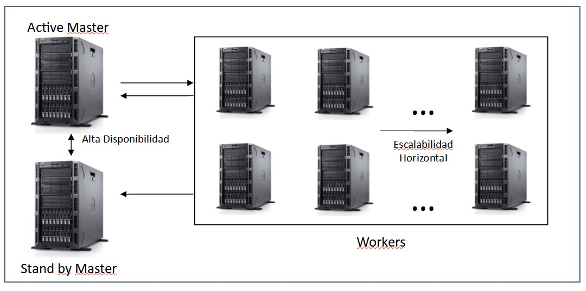
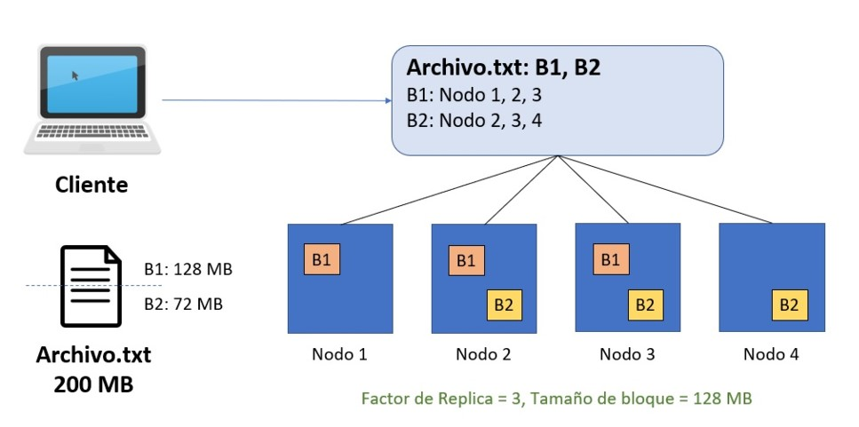
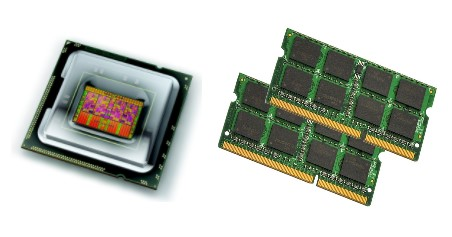
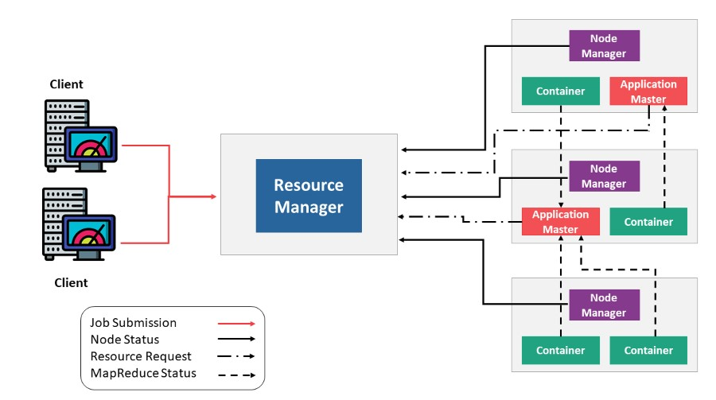

# Frameworks Hadoop
Entender qué es un Cluster Hadoop y la diferencia con una arquitectura Cliente-Servidor. Identificar los componentes Core de Hadoop (HDFS, YARN, MapReduce). Comprender el concepto de Frameworks en Hadoop. Conocer algunos Proveedores de Servicios (Vendors) de grado empresarial.

Temáticas a abordar en la clase:
- Hadoop
- Características Hadoop
- Cluster Hadoop
- HDFS (Hadoop Distributed File System)
- YARN (Yet Another Resource Negotiator)
- MapReduce
- Frameworks Hadoop
- Proveedores de Servicios (Vendors) de grado empresarial

## Hadoop
Es un sistema open-source diseñado para almacenar y procesar Big Data de forma distribuida utilizando un cluster de servidores.

### Características
1. Tolerancia a Fallos.
2. Escalabilidad Horizontal.
3. Utiliza commodity hardware.
4. Desarrollado en lenguaje Java.
5. Procesamiento en paralelo.
6. [Sitio Oficial](https://hadoop.apache.org/)

**Ecosistema**

**Cluster**

### Componentes Core
#### HDFS (Hadoop Distributed File System)

Master -> NameNode Worker -> DataNode

Hadoop permite organizar computadoras en una relación maestro–esclavo que contribuye a conseguir una gran escalabilidad para el procesamiento.

Un Cluster Hadoop tiene dos tipos de nodos, un único “Master Node” llamado NameNode y un gran número de “Workers Nodes” llamados DataNodes.

El Masternode administra el sistema de archivos, su “namespace” y controla el acceso a los archivos por los clientes, conociendo qué bloques de qué archivos están en cada DataNode. Un único MasterNode implica la necesidad de “Hot backups” para mantener la disponibilidad del servicio.

El MasterNode usa un log de transacciones para mantener un registro de cada cambio que ocurre en el sistema de archivos. Los DataNodes almacenan los bloques de datos en el espacio de almacenamiento dirigidos por el MasterNode. 

Cada DataNode típicamente contiene muchos discos para maximizar la capacidad de almacenamiento y la velocidad de acceso, y tienen su propio sistema de archivos local. Los DataNodes almacenan y distribuyen bloques de datos sobre la red usando un protocolo de bloques, gestionado por el DataNode.

Los NameNodes almacenan toda la información relevante acerca de todos los DataNodes, y los archivos almacenados en los DataNodes:

1. Para cada DataNode, su nombre, rack, capacidad y estado.
2. Para cada archivo, su nombre, réplicas, tipo, tamaño, "timeStamp", ubicación, estado.

El NameNode trata de asegurar que los archivos se distribuyan de forma pareja entre los DataNodes del clúster, también optimiza el ancho de banda y balancea la carga de procesamiento y almacenamiento.

Cada pieza de datos es almacenado típicamente en tres nodos, dos en el mismo rack y uno en un rack diferente.

Si un DataNode falla, éste puede ser recreado automáticamente en otra computadora, escribiéndose todos los bloques de archivos desde réplicas (otros DataNodes).

Los DataNodes se comunican por medio de mensajes ("heartbeats") para conocer el estado de los nodos. Sin ese mensaje se considera que el nodo ha fallado, y la replicación automáticamente reemplaza el nodo fallido.

En el Sistema de Bloques ("block system"), un bloque es la unidad fundamental de almacenamiento en HDFS. Se almacena la información de grandes archivos distribuyendo segmentos llamados bloques para ser almacenados en diferentes computadoras. El tamaño predeterminado de los bloques es de 64 o 128 MB dependiendo de la distribución:

**hdfs getconf -confKey dfs.blocksize**

Cada archivo de datos ocupa un determinado número de bloques, dependiendo de su tamaño y organizado en bloques consecutivos, para facilidad y velocidad de acceso. El tamaño de bloques y el factor de replicación puede ser configurado según se requiera.

Respecto de la Integridad de los datos, Hadoop asegura que no habrá pérdida o corrupción de datos durante el procesamiento y almacenamiento.

Los datos son escritos sólo una vez y nunca actualizados en el lugar, pueden ser leídos muchas veces.

Sólo un cliente a la vez puede escribir o agregar datos al archivo, no se permiten actualizaciones concurrentes.

Si algunos datos en un DataNode se pierden o corrompen, o hay una falla en el disco que los contiene, una nueva réplica en buen estado es recreada automáticamente desde una réplica en otro DataNode. Al menos una réplica es almacenada en un DataNode en un rack diferente.

Los archivos de entrada pueden variar desde pequeños a extremadamente grandes y con diferentes estructuras.

Los archivos secuenciales ("secuence files") son una estructura especializada de datos dentro de Hadoop para manejar pequeños archivos en registros pequeños.

Utilizan una estructura de datos persistentes HDFS y MapReduce están diseñados para gestionar archivos de gran tamaño, de manera que "empaquetar“ archivos pequeños en archivos secuenciales hace más eficiente su procesamiento y almacenamiento.

**Ejemplo de escritura HDFS**

#### YARN (Yet Another Resource Negotiator)

Master -> ResourceManager Worker -> NodeManager

Es el centro de la arquitectura de Hadoop, caracterizado como un sistema Operativo distribuido para aplicaciones de Big Data.
YARN administra recursos y "workloads" en un entorno seguro mientras asegura la alta disponibilidad en múltiples clusters Hadoop.

YARN brinda flexibilidad como una plataforma común para ejecutar múltiples aplicaciones y herramientas, de consultas interactivas SQL (Hive), de proceso de flujos en tiempo real (Spark), y procesamiento por lotes (MapReduce) para trabajar con los datos almacenados en una plataforma HDFS.
Brinda gran escalabilidad para expandirse más allá de 1000 nodos y provee ubicación dinámica de recursos del clúster.

##### Ejemplo de ejecución de Jobs en YARN
- [YARN] (https://hadoop.apache.org/docs/stable/hadoop-yarn/hadoop-yarn-site/YARN.html)

## MapReduce
>Permite procesar enormes cantidades de datos utilizando los servicios de gran cantidad de computadoras para trabajar en diferentes partes del trabajo ("job") simultáneamente, brindando capacidad de procesamiento en paralelo y tolerancia a fallos.
>
>La tarea de procesamiento de los datos se divide en muchas partes, cada una procesada de forma independiente de las otras y luego los resultados intermedios se combinan en el resultado final.
>
>**MapReduce** es un "framework" de procesamiento paralelo para acelerar el procesamiento de datos a gran escala, con un mínimo movimiento de los dados en el sistema de archivos distribuido del clúster Hadoop, obteniendo resultados cercanos al tiempo real.
>
>   - [MapReduce] (https://hadoop.apache.org/docs/stable/hadoop-mapreduce-client/hadoop-mapreduce-client-core/MapReduceTutorial.html)

La función **map()**: se encarga del mapeo y es aplicada en paralelo para cada ítem en la entrada de datos. Esto produce una lista de pares (k2,v2) por cada llamada.
Luego el se juntan todos los pares con la misma clave de todas las listas y los agrupa, creando un grupo por cada una de las diferentes claves generadas.

Desde el punto de vista de la arquitectura, el nodo master toma el input, lo divide en pequeñas piezas o problemas de menor identidad, y los distribuye a los denominados "worker nodes".
Un "worker node" puede volver a sub-dividir, dando lugar a una estructura de árbol.
El "worker node" procesa el problema y pasa la respuesta al nodo maestro "master node".
La función reduce es aplicada en paralelo para cada grupo, produciendo una colección de valores para cada dominio:

**Reduce(k2, list (v2)) -> list(v3)**

Típicamente se produce un valor v3 o una llamada vacía, aunque una llamada puede retornar más de un valor. El retorno de todas esas llamadas se recoge como la lista de resultado deseado.
Por lo tanto, el framework MapReduce transforma una lista de pares (clave, valor) en una lista de valores.

## Instalación Hadoop
Se puede instalar Hadoop en un clúster de computadoras "on premise" o utilizar servicios en la nube: Azure, IBMCloud, AWS. Requiere una instalación de Java y está escrito en ese lenguaje. Para instalaciones locales es útil contar con una interfaz gráfica como Cloudera Resouces Manager que permite la instalación de Hadoop y componentes relacionados, como YARN, HBase, Pig. Si se instala desde la línea de comandos, se debe descargar Hadoop de algunos de los "mirrors" de Apache.

La instalación en la nube es más sencilla que instalar Java Virtual Machines en computadoras locales. HDFS tiene una interfase de línea de comandos "UNIX-like". Use el "shell" sh para comunicarse con Hadoop.

## Frameworks Hadoop

## Proveedores de Servicios (Vendors) de grado empresarial
**1. [Cloudera](https://www.cloudera.com/)**
**2. [Amazon EMR](https://aws.amazon.com/es/emr/)**
**3. [Azure HDInsight](https://azure.microsoft.com/es-es/services/hdinsight/)**
**4. [IBM Analytics Engineer](https://cloud.ibm.com/catalog/services/analytics-engine)**
**5. [Google Dataproc](https://cloud.google.com/dataproc)**
**6. [MapR](https://mapr.com/)**

### Otras tecnologías Big Data
