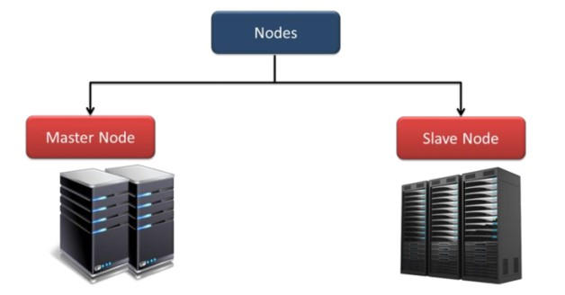
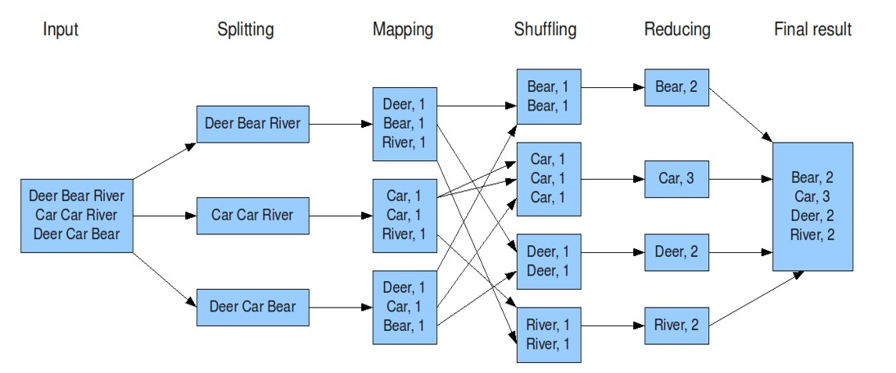

# Frameworks Hadoop
Entender qué es un Cluster Hadoop y la diferencia con una arquitectura Cliente-Servidor. Identificar los componentes Core de Hadoop (HDFS, YARN, MapReduce). Comprender el concepto de Frameworks en Hadoop. Conocer algunos Proveedores de Servicios (Vendors) de grado empresarial.

## Hadoop
Es un sistema open-source diseñado para almacenar y procesar Big Data de forma distribuida utilizando un cluster de servidores.

### Características
1. Tolerancia a Fallos.
2. Escalabilidad Horizontal.
3. Utiliza commodity hardware.
4. Desarrollado en lenguaje Java.
5. Procesamiento en paralelo.
6. [Sitio Oficial](https://hadoop.apache.org/)

**Ecosistema**

**Cluster**

### Componentes Core
#### HDFS (Hadoop Distributed File System)

Master -> NameNode Worker -> DataNode

Hadoop permite organizar computadoras en una relación maestro–esclavo que contribuye a conseguir una gran escalabilidad para el procesamiento.

Un Cluster Hadoop tiene dos tipos de nodos, un único “Master Node” llamado NameNode y un gran número de “Workers Nodes” llamados DataNodes.

El Masternode administra el sistema de archivos, su “namespace” y controla el acceso a los archivos por los clientes, conociendo qué bloques de qué archivos están en cada DataNode. Un único MasterNode implica la necesidad de “Hot backups” para mantener la disponibilidad del servicio.

El MasterNode usa un log de transacciones para mantener un registro de cada cambio que ocurre en el sistema de archivos. Los DataNodes almacenan los bloques de datos en el espacio de almacenamiento dirigidos por el MasterNode. 

Cada DataNode típicamente contiene muchos discos para maximizar la capacidad de almacenamiento y la velocidad de acceso, y tienen su propio sistema de archivos local. Los DataNodes almacenan y distribuyen bloques de datos sobre la red usando un protocolo de bloques, gestionado por el DataNode.

Los NameNodes almacenan toda la información relevante acerca de todos los DataNodes, y los archivos almacenados en los DataNodes:

1. Para cada DataNode, su nombre, rack, capacidad y estado.
2. Para cada archivo, su nombre, réplicas, tipo, tamaño, "timeStamp", ubicación, estado.

El NameNode trata de asegurar que los archivos se distribuyan de forma pareja entre los DataNodes del clúster, también optimiza el ancho de banda y balancea la carga de procesamiento y almacenamiento.

Cada pieza de datos es almacenado típicamente en tres nodos, dos en el mismo rack y uno en un rack diferente.

Si un DataNode falla, éste puede ser recreado automáticamente en otra computadora, escribiéndose todos los bloques de archivos desde réplicas (otros DataNodes).

Los DataNodes se comunican por medio de mensajes ("heartbeats") para conocer el estado de los nodos. Sin ese mensaje se considera que el nodo ha fallado, y la replicación automáticamente reemplaza el nodo fallido.

En el Sistema de Bloques ("block system"), un bloque es la unidad fundamental de almacenamiento en HDFS. Se almacena la información de grandes archivos distribuyendo segmentos llamados bloques para ser almacenados en diferentes computadoras. El tamaño predeterminado de los bloques es de 64 o 128 MB dependiendo de la distribución:

**hdfs getconf -confKey dfs.blocksize**

Cada archivo de datos ocupa un determinado número de bloques, dependiendo de su tamaño y organizado en bloques consecutivos, para facilidad y velocidad de acceso. El tamaño de bloques y el factor de replicación puede ser configurado según se requiera.

Respecto de la Integridad de los datos, Hadoop asegura que no habrá pérdida o corrupción de datos durante el procesamiento y almacenamiento.

Los datos son escritos sólo una vez y nunca actualizados en el lugar, pueden ser leídos muchas veces.

Sólo un cliente a la vez puede escribir o agregar datos al archivo, no se permiten actualizaciones concurrentes.

Si algunos datos en un DataNode se pierden o corrompen, o hay una falla en el disco que los contiene, una nueva réplica en buen estado es recreada automáticamente desde una réplica en otro DataNode. Al menos una réplica es almacenada en un DataNode en un rack diferente.

Los archivos de entrada pueden variar desde pequeños a extremadamente grandes y con diferentes estructuras.

Los archivos secuenciales ("secuence files") son una estructura especializada de datos dentro de Hadoop para manejar pequeños archivos en registros pequeños.

Utilizan una estructura de datos persistentes HDFS y MapReduce están diseñados para gestionar archivos de gran tamaño, de manera que "empaquetar“ archivos pequeños en archivos secuenciales hace más eficiente su procesamiento y almacenamiento.

**Ejemplo de escritura HDFS**

#### YARN (Yet Another Resource Negotiator)

Master -> ResourceManager Worker -> NodeManager

Es el centro de la arquitectura de Hadoop, caracterizado como un sistema Operativo distribuido para aplicaciones de Big Data.
YARN administra recursos y "workloads" en un entorno seguro mientras asegura la alta disponibilidad en múltiples clusters Hadoop.

YARN brinda flexibilidad como una plataforma común para ejecutar múltiples aplicaciones y herramientas, de consultas interactivas SQL (Hive), de proceso de flujos en tiempo real (Spark), y procesamiento por lotes (MapReduce) para trabajar con los datos almacenados en una plataforma HDFS.
Brinda gran escalabilidad para expandirse más allá de 1000 nodos y provee ubicación dinámica de recursos del clúster.

##### Ejemplo de ejecución de Jobs en YARN
- [YARN] (https://hadoop.apache.org/docs/stable/hadoop-yarn/hadoop-yarn-site/YARN.html)

## MapReduce
>Permite procesar enormes cantidades de datos utilizando los servicios de gran cantidad de computadoras para trabajar en diferentes partes del trabajo ("job") simultáneamente, brindando capacidad de procesamiento en paralelo y tolerancia a fallos.
>
>La tarea de procesamiento de los datos se divide en muchas partes, cada una procesada de forma independiente de las otras y luego los resultados intermedios se combinan en el resultado final.
>
>**MapReduce** es un "framework" de procesamiento paralelo para acelerar el procesamiento de datos a gran escala, con un mínimo movimiento de los dados en el sistema de archivos distribuido del clúster Hadoop, obteniendo resultados cercanos al tiempo real.
>
>   - [MapReduce] (https://hadoop.apache.org/docs/stable/hadoop-mapreduce-client/hadoop-mapreduce-client-core/MapReduceTutorial.html)

La función **map()**: se encarga del mapeo y es aplicada en paralelo para cada ítem en la entrada de datos. Esto produce una lista de pares (k2,v2) por cada llamada.
Luego el se juntan todos los pares con la misma clave de todas las listas y los agrupa, creando un grupo por cada una de las diferentes claves generadas.

Desde el punto de vista de la arquitectura, el nodo master toma el input, lo divide en pequeñas piezas o problemas de menor identidad, y los distribuye a los denominados "worker nodes".
Un "worker node" puede volver a sub-dividir, dando lugar a una estructura de árbol.
El "worker node" procesa el problema y pasa la respuesta al nodo maestro "master node".
La función reduce es aplicada en paralelo para cada grupo, produciendo una colección de valores para cada dominio:

**Reduce(k2, list (v2)) -> list(v3)**

Típicamente se produce un valor v3 o una llamada vacía, aunque una llamada puede retornar más de un valor. El retorno de todas esas llamadas se recoge como la lista de resultado deseado.
Por lo tanto, el framework MapReduce transforma una lista de pares (clave, valor) en una lista de valores.

## Instalación Hadoop
Se puede instalar Hadoop en un clúster de computadoras "on premise" o utilizar servicios en la nube: Azure, IBMCloud, AWS. Requiere una instalación de Java y está escrito en ese lenguaje. Para instalaciones locales es útil contar con una interfaz gráfica como Cloudera Resouces Manager que permite la instalación de Hadoop y componentes relacionados, como YARN, HBase, Pig. Si se instala desde la línea de comandos, se debe descargar Hadoop de algunos de los "mirrors" de Apache.

La instalación en la nube es más sencilla que instalar Java Virtual Machines en computadoras locales. HDFS tiene una interfase de línea de comandos "UNIX-like". Use el "shell" sh para comunicarse con Hadoop.

## Frameworks Hadoop

## Proveedores de Servicios (Vendors) de grado empresarial
**1. [Cloudera](https://www.cloudera.com/)**
**2. [Amazon EMR](https://aws.amazon.com/es/emr/)**
**3. [Azure HDInsight](https://azure.microsoft.com/es-es/services/hdinsight/)**
**4. [IBM Analytics Engineer](https://cloud.ibm.com/catalog/services/analytics-engine)**
**5. [Google Dataproc](https://cloud.google.com/dataproc)**
**6. [MapR](https://mapr.com/)**

### Otras tecnologías Big Data

# Práctica en Clase
*Consideraciones:*
- Es necesario tener instalado Docker.
- Registrarnos en Docker Hub.
- Al ejecutar las instrucciones, anteponer “sudo”.

Ejecutar en la consola el contenedor “hello-world” del Docker-Hub y luego verificar si está ejecutando:
1. $ docker run hello-world (corro el contenedor hello-world)
2. $ docker ps (muestra los contenedores activos)

Ejecutar una inspección de un contenedor específico
1. $ docker ps -a (muestra todos los contenedores)
2. $ docker inspect <container ID> (muestra el detalle completo de un contenedor)
3. $ docker inspect <name> (igual que el anterior pero invocado con el nombre)

Ejecutar el contenedor “hello-world” asignandole un nombre distinto.
1. $ docker run -d –-name hola-mundo hello-world (le asigno un nombre custom “hola-mundo”)
2. $ docker rename hola-mundo hola-a-todos (cambio el nombre de hola-mundo a hola-a-todos)

Ejecutar la eliminación de un contenedor (usar rm y prune)
1. $ docker rm <ID o nombre> (borro un contenedor)
2. $ docker container prune (borro todos lo contenedores que esten parados)
3. Explorar Docker Hub y probar ejecutar alguna de las imagenes. https://hub.docker.com/

11) Ejecutar la imagen “ubuntu”:
1. $ docker run ubuntu (corre un ubuntu pero lo deja apagado)
2. $ docker run -it ubuntu (lo corre y entro al shell de ubuntu)
    - i: interactivo
    - t: abre la consola

corre el siguiente comando en la consola de linux $ cat /etc/lsb-release (veo la versión)

Ejecutar la imagen “nginx” y probar los comandos “stop” y “rm”
1. $ docker run -d --name proxy nginx (corro un nginx)
2. $ docker stop proxy (apaga el contenedor)
3. $ docker rm proxy (borro el contenedor)
4. $ docker rm -f <contenedor> (lo para y lo borra)

12) Ejecutar nginx exponiendo el puerto 8080 de mi máquina
Exponer contenedores:
1. $ docker run -d --name proxy -p 8081:80 nginx (corro un nginx y expongo el puerto 80 del contenedor en el puerto 8080 de mi máquina)

1. localhost:8081 (desde mi navegador compruebo que funcione)

13) Ejecutar el comando logs para ver los logs del contenedor de nginx:
1. $ docker logs proxy (veo los logs)
    >/docker-entrypoint.sh: /docker-entrypoint.d/ is not empty, will attempt to perform configuration
    >/docker-entrypoint.sh: Looking for shell scripts in /docker-entrypoint.d/
    >/docker-entrypoint.sh: Launching /docker-entrypoint.d/10-listen-on-ipv6-by-default.sh
    >10-listen-on-ipv6-by-default.sh: info: Getting the checksum of /etc/nginx/conf.d/default.conf
    >10-listen-on-ipv6-by-default.sh: info: Enabled listen on IPv6 in /etc/nginx/conf.d/default.conf
    >/docker-entrypoint.sh: Sourcing /docker-entrypoint.d/15-local-resolvers.envsh
    >/docker-entrypoint.sh: Launching /docker-entrypoint.d/20-envsubst-on-templates.sh
    >/docker-entrypoint.sh: Launching /docker-entrypoint.d/30-tune-worker-processes.sh
    >/docker-entrypoint.sh: Configuration complete; ready for start up
    >2024/09/22 20:53:43 [notice] 1#1: using the "epoll" event method
    >2024/09/22 20:53:43 [notice] 1#1: nginx/1.27.1
    >2024/09/22 20:53:43 [notice] 1#1: built by gcc 12.2.0 (Debian 12.2.0-14)
    >2024/09/22 20:53:43 [notice] 1#1: OS: Linux 4.15.0-166-generic
    >2024/09/22 20:53:43 [notice] 1#1: getrlimit(RLIMIT_NOFILE): 1048576:1048576
    >2024/09/22 20:53:43 [notice] 1#1: start worker processes
    >2024/09/22 20:53:43 [notice] 1#1: start worker process 29
    >192.168.100.5 - - [22/Sep/2024:20:53:45 +0000] "GET / HTTP/1.1" 200 615 "-" "Mozilla/5.0 (Windows NT 10.0; Win64; x64) AppleWebKit/537.36 (KHTML, like Gecko) Chrome/129.0.0.0 Safari/537.36" "-"
    >2024/09/22 20:53:45 [error] 29#29: *1 open() "/usr/share/nginx/html/favicon.ico" failed (2: No such file or directory), client: 192.168.100.5, server: localhost, request: "GET /favicon.ico HTTP/1.1", host: "192.168.100.72:8081", referrer: "http://192.168.100.72:8081/"
    >192.168.100.5 - - [22/Sep/2024:20:53:45 +0000] "GET /favicon.ico HTTP/1.1" 404 555 "http://192.168.100.72:8081/" "Mozilla/5.0 (Windows NT 10.0; Win64; x64) AppleWebKit/537.36 (KHTML, like Gecko) Chrome/129.0.0.0 Safari/537.36" "-"

2. $ docker logs -f proxy (hago un follow del log)

    >/docker-entrypoint.sh: /docker-entrypoint.d/ is not empty, will attempt to perform configuration
    >/docker-entrypoint.sh: Looking for shell scripts in /docker-entrypoint.d/
    >/docker-entrypoint.sh: Launching /docker-entrypoint.d/10-listen-on-ipv6-by-default.sh
    >10-listen-on-ipv6-by-default.sh: info: Getting the checksum of /etc/nginx/conf.d/default.conf
    >10-listen-on-ipv6-by-default.sh: info: Enabled listen on IPv6 in /etc/nginx/conf.d/default.conf
    >/docker-entrypoint.sh: Sourcing /docker-entrypoint.d/15-local-resolvers.envsh
    >/docker-entrypoint.sh: Launching /docker-entrypoint.d/20-envsubst-on-templates.sh
    >/docker-entrypoint.sh: Launching /docker-entrypoint.d/30-tune-worker-processes.sh
    >/docker-entrypoint.sh: Configuration complete; ready for start up
    >2024/09/22 20:53:43 [notice] 1#1: using the "epoll" event method
    >2024/09/22 20:53:43 [notice] 1#1: nginx/1.27.1
    >2024/09/22 20:53:43 [notice] 1#1: built by gcc 12.2.0 (Debian 12.2.0-14)
    >2024/09/22 20:53:43 [notice] 1#1: OS: Linux 4.15.0-166-generic
    >2024/09/22 20:53:43 [notice] 1#1: getrlimit(RLIMIT_NOFILE): 1048576:1048576
    >2024/09/22 20:53:43 [notice] 1#1: start worker processes
    >2024/09/22 20:53:43 [notice] 1#1: start worker process 29
    >192.168.100.5 - - [22/Sep/2024:20:53:45 +0000] "GET / HTTP/1.1" 200 615 "-" "Mozilla/5.0 (Windows NT 10.0; Win64; x64) AppleWebKit/537.36 (KHTML, like Gecko) Chrome/129.0.0.0 Safari/537.36" "-"
    >2024/09/22 20:53:45 [error] 29#29: *1 open() "/usr/share/nginx/html/favicon.ico" failed (2: No such file or directory), client: 192.168.100.5, server: localhost, request: "GET /favicon.ico HTTP/1.1", host: "192.168.100.72:8081", referrer: "http://192.168.100.72:8081/"
    >192.168.100.5 - - [22/Sep/2024:20:53:45 +0000] "GET /favicon.ico HTTP/1.1" 404 555 "http://192.168.100.72:8081/" "Mozilla/5.0 (Windows NT 10.0; Win64; x64) AppleWebKit/537.36 (KHTML, like Gecko) Chrome/129.0.0.0 Safari/537.36" "-"

14) Ejecutar comando “logs –tail” para ver las últimas N entradas de log
1. $ docker logs --tail 10 -f proxy (veo y sigo solo las 10 últimas entradas del log)
    >2024/09/22 20:53:43 [notice] 1#1: using the "epoll" event method
2024/09/22 20:53:43 [notice] 1#1: nginx/1.27.1
2024/09/22 20:53:43 [notice] 1#1: built by gcc 12.2.0 (Debian 12.2.0-14)
2024/09/22 20:53:43 [notice] 1#1: OS: Linux 4.15.0-166-generic
2024/09/22 20:53:43 [notice] 1#1: getrlimit(RLIMIT_NOFILE): 1048576:1048576
2024/09/22 20:53:43 [notice] 1#1: start worker processes
2024/09/22 20:53:43 [notice] 1#1: start worker process 29
192.168.100.5 - - [22/Sep/2024:20:53:45 +0000] "GET / HTTP/1.1" 200 615 "-" "Mozilla/5.0 (Windows NT 10.0; Win64; x64) AppleWebKit/537.36 (KHTML, like Gecko) Chrome/129.0.0.0 Safari/537.36" "-"
2024/09/22 20:53:45 [error] 29#29: *1 open() "/usr/share/nginx/html/favicon.ico" failed (2: No such file or directory), client: 192.168.100.5, server: localhost, request: "GET /favicon.ico HTTP/1.1", host: "192.168.100.72:8081", referrer: "http://192.168.100.72:8081/"
192.168.100.5 - - [22/Sep/2024:20:53:45 +0000] "GET /favicon.ico HTTP/1.1" 404 555 "http://192.168.100.72:8081/" "Mozilla/5.0 (Windows NT 10.0; Win64; x64) AppleWebKit/537.36 (KHTML, like Gecko) Chrome/129.0.0.0 Safari/537.36" "-"

15) Ejecutar la imagen “mongodb” y asociarla con un directorio en mi máquina
1. $ mkdir dockerdata (creo un directorio en mi máquina)
2. $ docker run -d –-name mongodb -v <path de mi maquina>:<path dentro del contenedor(/data/db)> mongo (corro un contenedor de mongo y creo un bind mount)

Se debe entrar al directorio creado y desde ahí ejecutar el siguiente comando (o en su defecto copiar el resultado de pwd dentro del directorio en nuestra declaración):

docker run -d --name mongodb -v "$(pwd)":/data/db mongo

De arrojar error Exited (132) debemos usar otra versión (4.4 por ejemplo) usango mogno:X.X en vez de mongo solamente.2

16) Ejecutar el comando “exec” para introducirse en el shell de un contenedor:
1. $ docker ps (veo los contenedores activos)
2. $ docker exec -it mongodb bash (entro al bash del contenedor)

17) Ejecutar los siguientes comandos:
1. $ mongo (me conecto a la base de datos)
2. show dbs (listo las bases de datos)
3. use prueba (creo la base “prueba”)
4. db.prueba.insert({‘color’: ’azul’}) (inserto un nuevo dato)
5. db.prueba.find() (veo el dato que cargué)
6. Revisar el contenido del directorio creado
7. Volver a ejecutar el contenedor mongodb y verificar que el dato insertado en una ejecución previa ya se pueda ver, debido a que la nueva ejecución levanta lo datos ligados mediante Bind. Se debe usar el comando docker container start mongodb si está parado

18) Volúmenes
1. $ docker exec -it mongodb bash (ingresar al contenedor)
2. $ mongo (conectarse a la BBDD)
3. 
    - show dbs #se listan las BBDD
    - use prueba #se crea la BBDD prueba
    - db.prueba.insert({“color”:“azul”}) #se carga un dato
    - db.prueba.find() #se visualiza el dato cargado
4. Y al crear un nuevo contenedor se usa el mismo
- $ docker run -d --name db --mount type=bind,source='/home/ubuntu/dockerdata',target='/data/db' mongo

5. $ docker run -d --name ubuntu_test ubuntu tail -f /dev/null

6. $ docker exec -it ubuntu_test bash

7. En el contendedor, se crea el directorio “test”, al salir del contenedor para copiar un archivo dentro del contenedor: $ docker cp test.txt ubuntu_test:test
8. Copiar desde el contenedor a la máquina anfitrión: $ docker cp ubuntu_test:test [carpeta local]

19) Imagenes:
1. $ docker image ls (ver las imágenes que tengo localmente)
    - $ docker pull ubuntu:20.04 (bajo la imagen de ubuntu con una versión específica)

1. $ mkdir imagenes (creo un directorio en mi máquina)
    - $ cd imagenes (entro al directorio)

- $ touch hola.txt (creo un archivo txt y dentro ingreso la palabra 'hola')

- $ touch Dockerfile (creo un Dockerfile)

- $ vi Dockerfile (abro el Dockerfile con editor de textos 'vi')

##Contenido del Dockerfile##

FROM ubuntu:20.04
COPY /hola.txt /
RUN cat /hola.txt

##fin##

- $ docker build -t ubuntu:latest . (creo una imagen con el contexto de build <directorio>)
- $ docker run -it ubuntu:latest (corro el contenedor con la nueva imagen)

- $ docker login (me logueo en docker hub)

- $ docker tag ubuntu:latest miusuario/ubuntu:latest (cambio el tag para poder subirla a mi docker hub)

- $ docker push miusuario/ubuntu:latest (publico la imagen a mi docker hub)

La importancia de entender el sistema de capas consiste en la optimización de la construcción del contenedor para reducir espacio ya que cada comando en el dockerfile crea una capa extra de código en la imagen.

Con docker commit se crea una nueva imagen con una capa adicional que modifica la capa base.

Ejemplo: crear una nueva imagen a partir de la imagen de Ubuntu.

- $ docker pull ubuntu

- $ docker images

- $ docker run -it bin/bash

Como ejemplo, modificar el contenedor ejecutando lo siguiente:

- $ apt update
- $ apt-get install nmap
- $ nmap www.google.com (Nmap sirve para efectuar rastreo de una URL y/o puerto)
- $ docker commit ubuntu-nmap

- $ docker history ubuntu:ubuntu2 (ver la info de como se construyó cada capa)

- $ dive ubuntu:ubuntu2 (ver la info de la imagen con el programa dive)

20) Redes
Ejecutar los siguientes comandos:
1. $ docker network ls (listar las redes)
2. $ docker network create --attachable test_red (crear la red)
3. $ docker inspect test_red (ver definición de la red creada)
4. $ docker run -d --name db mongo (creo el contenedor)
5. $ docker network connect test_red db (conecto el contenedor “db” a la red “test_red”)
6. $ docker run -d --name app -p 3000:3000 --env MONGO_URL=mongodb://db:27017/test ubuntu (corro el contenedor “app” y le paso una variable)
7. $ docker network connect test_red app (conecto el contenedor “app” a la red “test_red”)