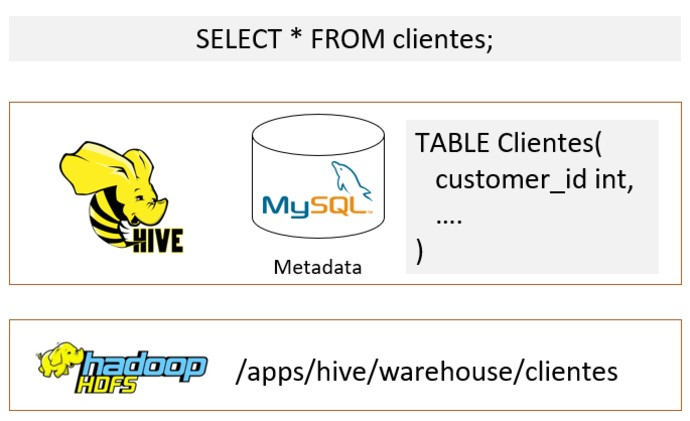
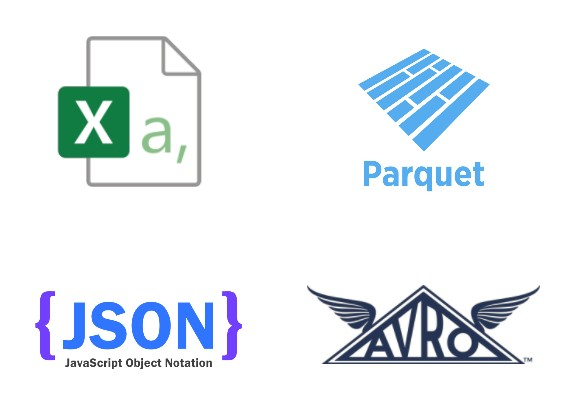
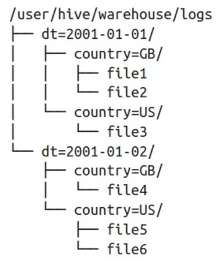
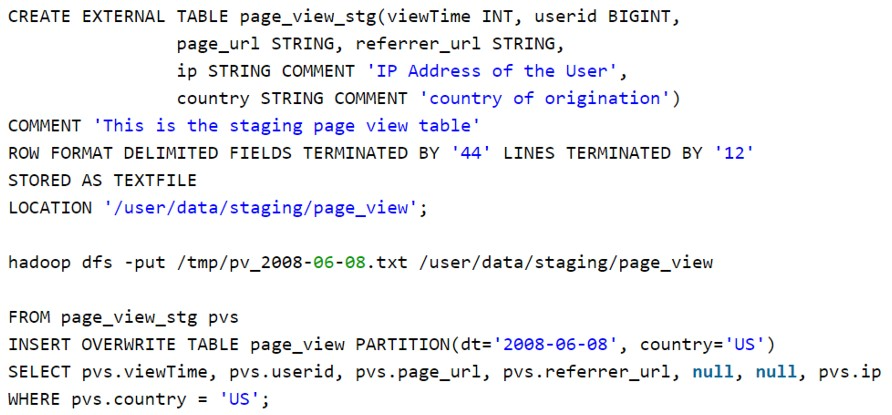
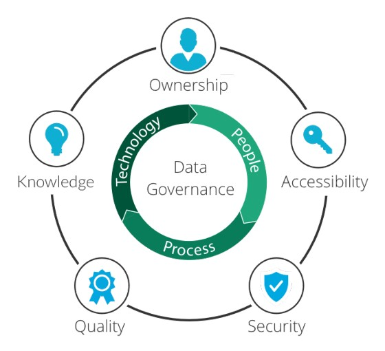

# Hive
1. Permite crear infraestructuras de tipo de data warehouse sobre Hadoop para realizar análisis de grandes volúmenes de datos.
2. Asigna una estructura tabular (metadata) a los datos en bruto almacenados en HDFS.

## HiveQL (Hive Query Language)
1. Hive utiliza un subconjunto de comandos SQL.
2. Data Definition Language https://cwiki.apache.org/confluence/display/Hive/LanguageManual+DDL
3. Data Manipulation Language https://cwiki.apache.org/confluence/display/Hive/LanguageManual+DML
4. Las operaciones de UPDATE y DELETE no están habilitadas por defecto.

## Tipos de Tablas
| **MANAGED**                                                                 | **EXTERNAL**                                                                |
|-----------------------------------------------------------------------------|-----------------------------------------------------------------------------|
| Hacen referencia a un path dentro de HDFS que es administrado por Hive   | Generan metadata para un path de HDFS que no es administrado por Hive    |
| El valor por defecto se especifica en el parámetro `hive.metastore.warehouse.dir` y típicamente es `/user/hive/warehouse/`  | Debemos agregar la palabra clave EXTERNAL y especificar el path de HDFS en la sección LOCATION  |
| En caso de realizar una operación de tipo DROP TABLE, Hive eliminaría la metadata de la tabla y los datos(1) | En caso de realizar una operación de tipo DROP TABLE, Hive eliminaría la metadata de la tabla pero no los datos |

## Tipos de datos
Hive, además de los tipos de datos comunes a todos los motores de bases de datos relacionales, ofrece una nueva categoría de tipos de datos complejos:

- ARRAY<data_type>
- MAP<primitive_type, data_type>
- STRUCT<col_name : data_type, ...>

## Formatos de Almacenamiento
Hive permite leer y escribir datos en diferentes formatos de archivos. Habitualmente se utilizan 2 formatos:
- CSV para los datos en bruto
- Parquet para los datos procesados

## Particiones
El particionamiento es una forma de dividir una tabla en partes relacionadas en función de los valores de columnas particulares (por ej. fecha, la ciudad y el departamento). Cada tabla puede tener una o más claves de partición para identificar una partición particular. Esta forma de almacenar los datos permite realizar consultas mas eficientes.

Enlace de Referencia: [Hive](https://cwiki.apache.org/confluence/display/Hive/Home)

## Hive SerDes
Acrónimo de Serializer/Deserializer. Permite interpretar diferentes formatos. SerDes disponibles en Hive:
- Avro (Hive 0.9.1 and later)
- ORC (Hive 0.11 and later)
- RegEx
- Thrift
- Parquet (Hive 0.13 and later)
- CSV (Hive 0.14 and later)
- JsonSerDe (Hive 0.12 and later in hcatalog-core)

Enlace de Referencia: [SerDes](https://cwiki.apache.org/confluence/display/Hive/SerDe)

### Hue (Hadoop User Experience)
Es una interfaz web que permite ejecutar consultas SQL hacia diferentes motores de bases de datos, principalmente relacionados a Big Data.

**Bases de datos soportadas** --> [VER](https://docs.gethue.com/administrator/configuration/connectors/)

**Entorno de prueba gratuito** --> [VER](https://demo.gethue.com/hue/accounts/login?next=/)

# Gobernanza del Dato (Data Governance)

Es un concepto que propone considerar a los datos como activos de una empresa y su gestión debe estar alineada con los objetivos estratégicos y está cobrando importancia en las organizaciones.

Relacionado en gran medida en velar por la calidad del mismo desde el momento de su generación, ya que tiene que ver con darle al ciclo de vida del dato, una persona o grupo de personas, que sean responsables por conocer su recorrido completo, desde las implicancias de cómo, dónde, por qué y por quién es generado, hasta de qué forma ese dato aporta información valiosa a la hora de tomar decisiones y evaluar nuestra posición frente a objetivos planteados.

Gestionar el dato no es sólo procesar y almacenar. Se trata de gestionar la seguridad, el cumplimiento de la normativa y la segregación del acceso, por no hablar de la lucha diaria por resolver los problemas causados por la mala calidad de los datos. El estudio de Gartner estima que la empresa media gasta 13,5 millones de dólares al año en todo el mundo debido a la mala calidad de los datos.

La Gobernanza de datos es la definición de las normas y el control sobre la gestión de datos, en términos de planificación, ejecución y seguimiento. Detrás de las operaciones está la estrategia.

La gobernanza de datos es la capacidad de gestionar los datos como un verdadero activo empresarial.

En otras palabras, al igual que la gestión de cualquier otro activo, por ejemplo, un depósito, una maquinaria, un servicio innovador o, en general, cualquier otro elemento que tenga valor para la empresa, los datos también necesitan unas reglas básicas para que puedan producir valor económico.

Hoy por hoy, se usa en la mayor parte del mundo, la gobernanza de los datos parece ser una prerrogativa de aquellos sectores, como bancos y compañías de seguros, que de alguna manera se ven obligados a activar estrictos mecanismos de control, ya sea por regulaciones específicas o porque su negocio principal está históricamente vinculado a la gestión de datos.

Para estos sectores, la gobernanza de datos suele significar la creación de nuevas estructuras organizativas, más o menos centralizadas, que definen las políticas de buena gestión de los datos y comprueban que se respetan estos procedimientos.

Parece, por tanto, que la gobernanza de los datos no es una tarea para todas las demás organizaciones, que se quedan con el temor de volverse inflexibles a causa de las nuevas funciones y los nuevos procesos, percibidos como un costo más que como un elemento de ventaja competitiva. Pero la gobernanza de los datos no implica necesariamente un aumento de los costos y del personal. Todo lo contrario.

La gobernanza de los datos significa utilizar la influencia de la organización para garantizar que los datos se gestionen correctamente. 

¿Significa esto crear gastos generales para las actividades de gestión? No necesariamente. 

Ciertamente, se trata de garantizar que haya claridad
1. sobre el significado de cada dato;
2. en las responsabilidades de la empresa y no en las de la informática;
3. sobre los criterios para definir una figura de calidad
4. en garantizar que todo esto se conozca en toda la organización.

Es esencial cambiar la cultura de datos de toda la organización, el comportamiento de las personas y los procesos empresariales. Incluso antes de definir nuevos procesos ad hoc, se trata de verificar cómo deben gestionarse los datos en los procesos existentes, de adoptar un lenguaje común y de garantizar que el personal que se ocupa de los datos tenga las competencias adecuadas.

Las ventajas de introducir la gobernanza de datos son múltiples. El reto, así como el punto de partida de un programa eficaz, es identificar los que mejor se adaptan a su organización. Entre ellas se encuentran:

 **Aumento de los ingresos**

La gobernanza de los datos aporta soluciones empresariales sólidas destinadas a aumentar la cuota de mercado, como sofisticados algoritmos de fijación de precios o metodologías para personalizar la experiencia del usuario. 

 **La confianza**

Un director general y su línea de mando pueden confiar en los datos que utilizan para tomar decisiones, aumentando así la capacidad de respuesta de la empresa. 

 **Mitigación de riesgos**

Incluso hoy en día, la mayoría de los programas de gobernanza de datos están impulsados por las necesidades de seguridad, privacidad y cumplimiento de la normativa. Gestionar correctamente los datos significa ser capaz de identificar, controlar y anticipar los riesgos. 

 **Monetización**

Crear productos de datos para venderlos en el mercado a otras organizaciones (por ejemplo, los datos que las compañías telefónicas facilitan para seguir el flujo de personas en una zona geográfica determinada).

 **Difusión de conocimientos**

Hacer explícito el conocimiento reduce los problemas de diferentes interpretaciones de los mismos datos, pero también los costos de ingeniería inversa del código del software para encontrar, por ejemplo, cómo se calculan las métricas que utiliza la empresa.

 **Apoyo a los programas empresariales**

La gobernanza de los datos interviene indirectamente en apoyo de los programas estratégicos que están en marcha en la organización, garantizando una gestión adecuada de los datos (por ejemplo, programas de gestión de datos maestros, cambio de ERP, etc.).

No sólo las líneas de negocio se benefician de la gobernanza de datos. Las unidades de Sistemas de Información, por su parte, pueden beneficiarse de:

- Definición más clara de las solicitudes gestionadas, gracias a la introducción de un diccionario de datos que hace que el significado de la información sea claro e inequívoco.
- La propiedad. Distinción de responsabilidades y actividades en el marco de las TI en lugar de la línea de negocio.
- Integración. Mayor facilidad de integración entre sistemas de información y entre diferentes fuentes de datos.
- La cultura. Concienciación de la organización sobre el uso correcto de los datos y difusión de una cultura basada en ellos.

*¿Quieres saber más?*
Visita este enlace para seguir profundizando sobre el tema. [IR](https://ranger.apache.org/)

(Ranger: políticas de seguridad)

*¿Quieres saber más?*
Visita este enlace para seguir profundizando sobre el tema.[IR](https://atlas.apache.org/)

(Atlas: catálogo de datos)

# Notas clases:

Los cuatro componentes de Docker con los que podemos interactuar son: imágenes, contenedores, volúmenes y networks.

**IMAGENES:** instalaciones de software y darle instrucciones al contenedor de cómo correr

**CONTENEDOR:** serie de procesos indicados por la imagen

**VOLÚMENES:** nos sirve para (persistir?) data

**NETWORKS:** RED. nos sirve para crear un cluster de Hadoop

En la parte interna de Docker es donde entra cliente de Docker, Daemon, etc.

# HIVE
Es una interfaz de SQL que posteriormente se va a traducir a MapReduce, que sirve principalmente para crear data warehouse

*¿Por qué un data warehouse sobre un cluster?*
Una vez que llegamos a big data --> en cuanto volumen y variedad, se puede hacer un data warehouse en hive.

Hive nos permite crear infraestructuras del tipo data warehouse, lo que nos permite hacer analítica sobre data distribuida. Muy parecido a SQL

La metadata se va a almacenar en tabla de MySQL

## HiveQL (Hive Query Language)
Es el análogo a SQL que utiliza Hive

- Hive utiliza un subconjunto de comandos SQL --> utiliza gran parte, pero hay ligeras diferencias.

- Data Definition Language --> para crear objetos, funciones, etc.

- Data Manipulation Language --> para la manipulación de esa información

- Las operaciones de UPDATE y DELETE no están habilitadas por defecto --> esto sucede porque Hive está pensado para ser un data warehouse y no un sistema transaccional.
Data warehouse, no está pensado para ser usado en el día a día

Al final de cuentas, Hive es un traductor, todo lo que está pasando se va a traducir un código de MapReduce.
También se puede pensar como una interfaz, donde se accede a MapReduce a través de código SQL.

## Tipo de carpetas (está en el README)

## Tipo de datos
Vamos a tener los mismos tipos de datos que manejamos en SQL: VARCHAR, int, decimal, etc.

Pero también vamos a encontrarnos con  
**- ARRAY**(ARREGLOS)<data_type>, que se pueden pensar como listas de Python. 
**- MAP** <primitive_type, data_type>, es el análogo a un diccionario de Python, donde hay una clave y un valor. Siempre va a ser un tipo de dato asociado a otro tipo de dato. 
**- STRUCTURE** <col_name: data_type,...>, se puede pensar como una clase de Python, pero sin métodos, solo con atributos. Acá será un nombre asociado un tipo de dato. 

Preguntas:
1. *Para utilizar Hive ¿es necesario aprender un lenguaje nuevo?* NO, es ~70-80% similar a SQL. Si hay algo que no se, se googlea

2. *¿Qué tipo de sistema de manejo de datos se puede armar con HDSF y Hive?* Un **data warehouse**.

3. *¿Por qué Hive acepta tipos de datos más complejos?* se utilizan tipos de datos que no son necesariamente tabulares, por ejemplo tipo json. Entonces como pueden contener distintos tipos de datos, necesitamos más tipos de datos para poder manejarlos.

## Formato de datos
Los formatos csv y json son secuenciales.
Los formatos parquet y avro son binarios, quiere decir que no almacenan la información en forma secuencial, sino que lo hace de manera de optimizar el espacio. En otros casos, se pueden optimizar por query, hace que se mejore la performance (por ejemplo de un group by).

*¿Por qué se utiliza "bastante" el formato JSON?* por las APIs, cualquier sistema que requiera comunicación entre entidades, se comunican a través de APIs, y las APIs se comunican a través de JSON. Es el formato estándar para la comunicación.
Generalmente la data cruda viene en formato JSON. 

## Particiones
Es análogo al proceso de ETL que hicimos, es decir armar índices

La partición sirve para la eficiencia, permite hacer querys más rápido porque son menos pesadas, y si estamos trabajando en la nube (como es habitual) se reducen costos. En definitiva aumenta la eficiencia en tiempo (son más rápidos) y en costos.

***Siempre se debe pensar quién es el usuario y sus necesidades para realizar la particiones que más le convenga***
> si utiliza uno u otro filtro, una u otra arquitectura, etc.

## Hive SerDes (está en el README)

Preguntas:
1. *¿Qué ventaja ofrece el uso de particiones?* Eficiencia en tiempo y eficiencia en costos

2. *¿Qué formatos de datos soporta HDFS y podemos ver con Hive?* específicamente en esta clase vimos: csv, json, parquet y avro 

# Governanza del dato
- Ownership: suele haber una persona (sola o que lidera un equipo) que es la encargada/responsable de la data de una organización y si esta es muy grande, de un área de la organización

- Knowledge: se refiere a todos los reportes que realizamos a partir de la data

- Quality: *calidad del dato* la persona encargada (ownership) es la responsable de validar o dirigir el equipo que realice la validación del dato

- Security: a qué personas les damos permisos para que puedan acceder a la información, o más aún para modificarla/eliminarla (este último es más sensible, no suele hacerse, hay que hacer backups).

- Accessibility: nuevamente, qué personas tienen permisos de acceder a la data

La organización debe tener una persona que conozca la información a grandes rasgos. (ejemplo de banco: cantidad de usuarios, si son activos, si este número cambió a lo largo del tiempo, etc). que también va a servir de validación del dato.