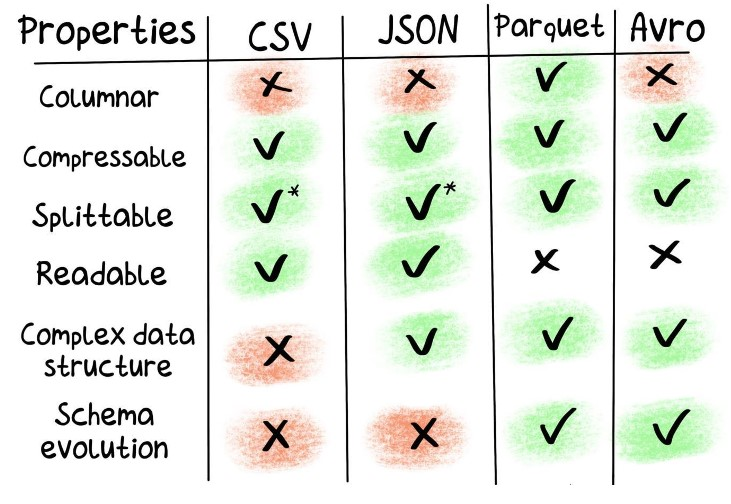

# Formatos de almacenamiento
>Recordatorio: los formatos secuenciales son cvs y json, los formatos binarios son parquet y avro

¿Cuál es formato correcto en el que deberíamos guardar la data según el caso de uso que tengamos?
 Depende del uso que vayamos a darle. Si vamos a guardarla para probablemente no usarla nunca hay que elegir un determinado formato, en cambio si la vamos a usar cotidianamente, por ejemplo haciendo group by, hay que guardarlo en otro formato específico.
Cada caso de uso va a tener cierto performance, y cierta reducción de costo, dependiendo del formato que escojamos.

¿Cuáles son los factores de elección?
**-Filas vs columnas:**
	- filas ---> como venimos usando, todos los datos independientes se almacenan en filas --> **csv** es un ejemplo
	- columnas ---> los datos se almacenan en una columna (es la transpuesta a la anterior) --> **parquet** es un ejemplo.

El formato de columna nos da ventajas a la hora de hacer 'filtros', ya que carga solo las columnas del filtro, entonces hay un manejo más eficiente. Pero en el caso de elegir un select * (toda la tabla) es indistinto.

Apache HBASE --> almacena data en formato columnar

**-EVOLUCIÓN DEL ESQUEMA:**
Se refiere a agregar o quitar columnas/campo (como atributo nuevo/viejo del dato). 

**-Factor de compresión**
Se refiere que tanto vamos a comprimir la data. 
El formato que menos compresión permite es json. Pero es muy utilizado: en MongoDB, en APIs, etc.
No es el formato más conveniente para big data.

- Tiempo de ingesta: qué tanto tiempo demora. Los mejores son csv y json. Tanto parquet como avro, envían además metadata, por lo que tardan más.

- Tiempo de acceso a una data random (random data lookup), en estos casos son mejores parquet y avro, siendo el menos eficiente json. 
> JSON se usa, pero no es óptimo a la hora de usar querys, solicitar información o agregando información.

- Otro punto de comparación son las estadísticas: mínimo, máximo, etc. Nuevamente vemos que el menos eficiente por lejos es JSON.

- Procesar data: el mejor es parquet, el peor es JSON

-Grouping by: el mejor es avro, seguido de parquet, un intermedio es cvs, y lejos el peor es json.

*---> Todo esto está en el blog de Big Data*

*Cuáles son los tres criterios para elgir un formato u otro?*
- Filas vs. columnas
- Compresión
- Evolución de esquema

# CSV
Es un texto plano, delimitado por el carácter de la coma (puede utilizarse otros separadores). Generalmente este formato lo utilizan aplicaciones tradicionales para exportar datos hacia otros sistemas. 
Es un formato de almacenamiento del tipo **SECUENCIAL**
*¿Por qué csv es super utilizado?*
1. es secuencial, se puede abrir con un editor de texto, e incluso analizar con Excel
2. es fácil de leer y escribir, no es necesario conocer ninguna tecnología o lenguaje específico, con un editor de texto o Excel, puedo trabajarlo.

# JSON
Tiene una estructura anidada, muestra campos en los cuales anidado puede tener mayor cantidad de información.
Presenta una jerarquía de datos anidados. Hay una estructura.
Una ventaja de JSON, es la flexibilidad, ya que no tenemos que agregar de antemano las columnas que vamos a utilizar, sino que constantemente podemos agregar o quitar más campos, según la necesidad.
Este flexibilidad no implica desorden, ya que si hay desorden no importa con qué programa vayamos a trabajar la calidad del dato va a ser mediocre. Si la variedad de JSON es muy amplia, a la hora de extraer data no se va a poder.
Tiene una estructura similar al diccionario de Python

# Avro
Es un formato **binario**. A pesar de esto guarda la información en formato **fila**.
Otra caracteristica es que está acmopañada de **metadata** que nos permite ver cómo  construimos esa data para después poder pasarla a un formato **columnar**. 
*Es recomendable para cosultas del tipo* ***SELECT ****

# Parquet
Es lo contrario a Avro, no se recomienda para consultas del tipo ***SELECT ("asterisco")***
*Es recomendable para consultas de agregación (tipo AVG, SUM, etc)*
Es un formato del tipo **columnar**. 
Es un formato binario.

# Resumen

* En JSON sí se puede cambiar el esquema, por lo que permite la evolución del esquema.

## Preguntas
- ¿Qué formato de almacenamiento es el más óptimo para un SELECT *? ***AVRO***
- ¿Cuál es el único formato de los que hemos visto que es columnar? ***Parquet***
- ¿Qué formato de los que hemos visto son secuenciales? ***csv y JSON***

# Herramientas de compresión de datos.
Compresión --> es similar a WinZip y WinRAR. 
Por qué queremos comprimir data? para obtener un mejor rendimiento: aumentar la capacidad de reducir un archivo y la velocidad de compresión y decompresión. En definitiva necesitamos que los archivos pesen menos y luego a que la hora de necesitarlos poder acceder a ellos en un tiempo óptimo.

(en el README están las herramientas)

## Preguntas
- ¿Cuáles son las caracteristicas más importantes en una herramienta de compresión?
***La capacidad de compresión y la velocidad de compresión y descompresión.***
- Cuál es la herramienta de compresión que gana en volumen, que es la mejor en volumen? ***gzip***
- Cuál es la otra herramienta que es bastante buena y además tiene un buen balance en la velocidad de compresión y decompresión? ***Snappy***