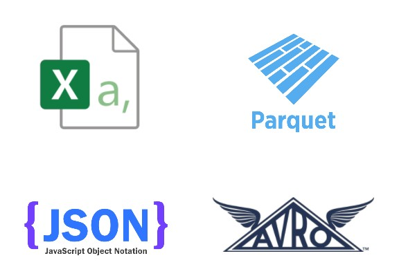
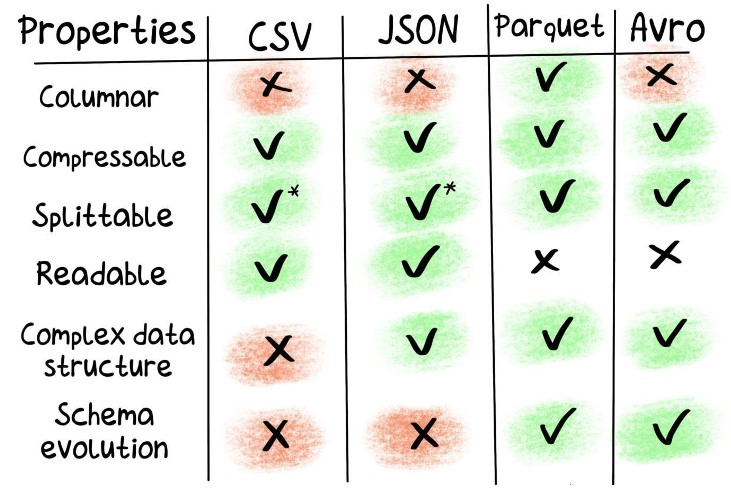

# Formatos de almacenamiento
La elección de un formato correcto puede traducirse en mejoras de performance y reducción de costos.

## Factores de elección
Al momento de elegir un formato de almacenamiento, debemos considerar los siguientes puntos:

**ROW vs COLUMN:** las consultas serán de tipo SELECT * o agregaciones AVG, SUM, etc

**SCHEMA EVOLUTION:** que sucede si debemos agregar, eliminar o modificar un campo

**COMPRESSION:** equilibrio entre espacio en disco utilizado y tiempo de procesamiento

Enlace recomendado: Formatos de archivo de Big Data [IR](https://luminousmen.com/post/big-data-file-formats)

## CSV
Texto plano delimitado por el carácter de la coma (pueden utilizarse otros separadores). Generalmente este formato lo utilizan aplicaciones tradicionales para exportar datos hacia otros sistemas.

## JSON

## Avro
Almacena los datos en formato binario para reducir el tamaño y mejorar la performance. La definición de los datos (schema) se almacena en formato JSON. Es recomendable utilizarlo para consultas de tipo SELECT *.

## Parquet
Es un formato de almacenamiento columnar que surge de la colaboración de Twitter y Cloudera. Los datos se almacenan en formato binario y al final del archivo se agrega la metadata (schema). Este formato es ideal para agregaciones AVG, SUM, etc.

## En resumen...

**Enlaces de referencia:** 
**Parquet** [VER](https://parquet.apache.org/documentation/latest/) (este enlace no funciona) 
**Avro** [VER](https://avro.apache.org/docs/current/)  
**JSON** [VER](https://www.json.org/json-es.html)  

## Herramientas de compresión de datos de Hadoop

1. gzip - org.apache.hadoop.io.compress.GzipCodec
2. bzip2 - org.apache.hadoop.io.compress.BZip2Codec
3. LZO - com.hadoop.compression.lzo.LzopCodec
4. Snappy - org.apache.hadoop.io.compress.SnappyCodec
5. Deflate - org.apache.hadoop.io.compress.DeflateCodec

### Ejemplo de Parquet y Snappy

