# SQL - NoSQL
ㅤ
## SQL
Las bases de datos relacionales, RDBMS son universalmente utilizadas prácticamente por todas las empresas, están estructuradas y optimizadas para asegurar la consistencia y exactitud de los datos, mientras también eliminan Redundancia. Estas bases se almacenan en grandes y confiables servidores para asegurar que los datos estén siempre disponibles.

**Características:**
1. Formato tabular
2. Tipos de datos
3. Relaciones (JOINS)
4. Restricciones (PK, FK)

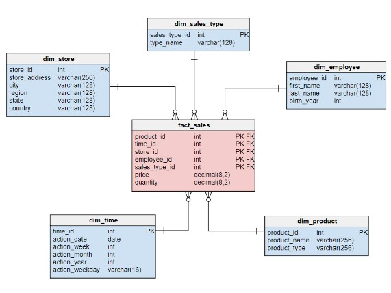

## NoSQL
Los sitios web de escala global (Amazon, Google, Facebook) fueron los primeros en desarrollar y utilizar estos sistemas. Son sistemas de administración de bases de datos no-relacionales, distribuidas, de código abierto, escalables y con datos almacenados en diferentes formatos. Una base de datos NoSQL (“Not Only SQL”) es una manera efectiva de organizar gran cantidad de datos heterogéneos con acceso y actualizaciones de datos eficientes.
Esto se logra flexibilizando algunas restricciones de integridad y redundancia en el almacenamiento de datos propias de bases de datos relacionales, RDBMS (“Relational Database Management Systems”). Big Data genera mucha cantidad de datos y a gran velocidad siendo las bases de datos relacionales no adecuadas para esa tarea, y sería también muy costoso su Almacenamiento.
Administrar el costo y la velocidad de esta enorme cantidad de datos heterogéneos requiere relajar muchas de las reglas estrictas y requerimientos de RDBMS. Dependiendo de qué restricciones son modificadas, surgirá un tipo diferente de estructura de bases de datos, llamadas NoSQL. Las bases de datos NoSQL son bases de próxima generación no-relacionales en su diseño. Son muy útiles para analizar y utilizar masivas cantidades de datos de datos estructurados o no estructurados almacenados en servidores remotos.

**Características:**
1. Casos de uso específicos
2. Esquema flexible
3. Escalabilidad horizontal
4. No utilizan SQL ni JOINS

# ACID vs BASE
NoSQL no soporta el esquema relacional y las propiedades asociadas con los procesos transaccionales propios de RDBMS, ACID (“Atomicity, Consistency, Isolation, Durability”). En cambio soporta propiedades BASE (“Basically Available, Soft State, Eventually Consistent”). Las bases NoSQL son aproximadamente precisas en cualquier punto del tiempo y eventualmente consistentes.

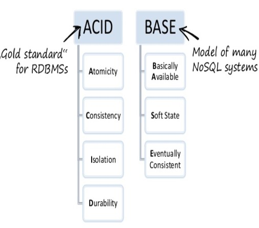

## RDBMS – ACID
**Atomicidad:** la ejecución de cada transacción es atómica, se realizan todas las acciones o ninguna.
**Consistencia:** Cada transacción preserva la integridad.
**Aislamiento:** Una transacción no puede afectar a la Otra.
**Durabilidad:** Persistencia de los cambios luego de un “COMMIT”.

#### BASE

## NoSQL – Base
**Básicamente disponible:** garantiza la disponibilidad de los datos, responde a cada solicitud.
**Soft State:** El estado del sistema puede cambiar en el tiempo, (consistencia eventual).
**Consistencia eventual:** el sistema “eventualmente” es consistente una vez que termina de recibir datos, los datos se propagan y el sistema no chequea la consistencia de cada transacción antes de mover a la siguiente.

# Teorema CAP
Un sistema es considerado Consistente (“Consistency”) si todas las réplicas contienen el mismo valor. Un sistema es considerado Disponible (“Availability”) si los datos están disponibles en todo momento. Un sistema tiene tolerancia a Particiones (“Partition Tolerance”) si el procesamiento puede continuar en ambas particiones en dos o más “islas”.

Es importante también que la data sea consistente y esté disponible aún ante un fallo en la red que deje “particionada” la base en “islas”. De acuerdo con el Teorema CAP no es posible proveer simultáneamente más de dos de las tres propiedades (Consistencia, Disponibilidad, Particionado).

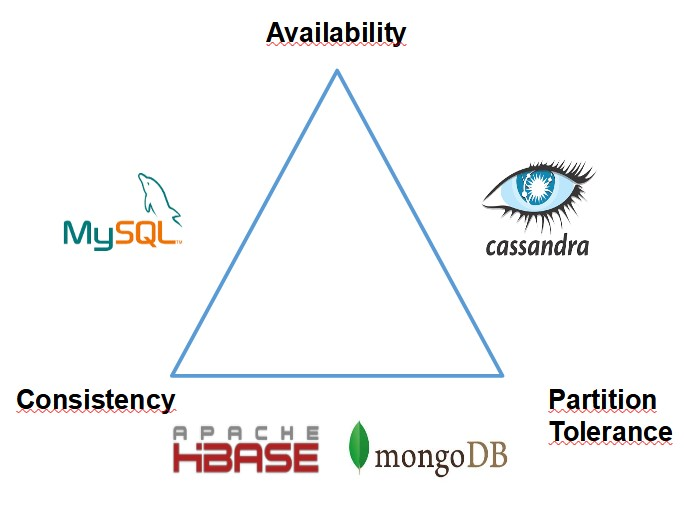

Se sacrifica consistencia a cambio de mayor rendimiento a través de la distribución de los datos. Ningún sistema distribuido está a salvo de las fallas de la red, por lo tanto, la partición de la red generalmente tiene que ser tolerada. En presencia de una partición, quedan dos opciones: consistencia o disponibilidad.

Al elegir la consistencia sobre la disponibilidad, el sistema devolverá un error o un tiempo de espera si no se puede garantizar que la información particular esté actualizada debido a la partición de la red. Al elegir la disponibilidad por consistencia, el sistema siempre procesará la consulta e intentará devolver la versión disponible más reciente de la información, incluso si no puede garantizar que esté actualizada debido a la partición de la red.

En ausencia de falla de la red, es decir, cuando el sistema distribuido se está ejecutando normalmente, se puede satisfacer tanto la disponibilidad como la consistencia.

## Tolerancia a Particiones

Con frecuencia, CAP se malinterpreta como si uno tuviera que elegir abandonar una de las tres garantías en todo momento. De hecho, la elección entre la consistencia y la disponibilidad se da solo cuando ocurre una partición de red o falla; en cualquier otro momento, no hay que hacer concesiones. Los sistemas de base de datos diseñados teniendo en cuenta las garantías tradicionales de ACID, como RDBMS, eligen la consistencia sobre la disponibilidad; mientras que los sistemas diseñados en torno a la filosofía BASE, comunes en el marco NoSQL, eligen la disponibilidad sobre la consistencia.

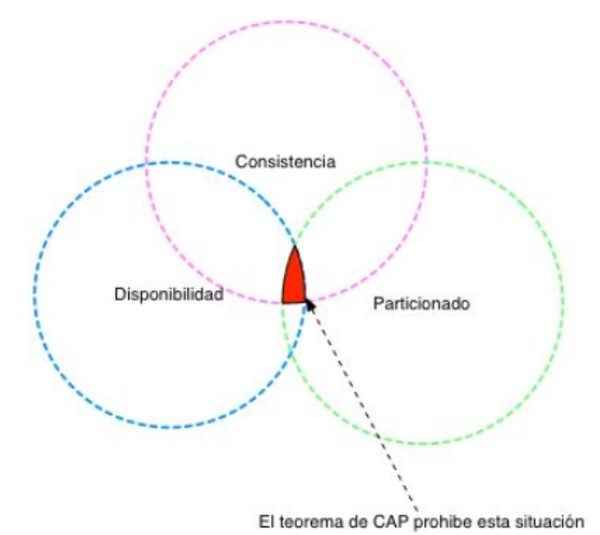

### Disponibilidad
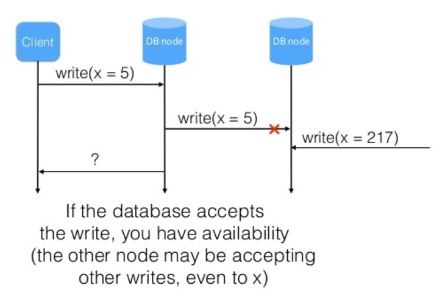

### Consistencia
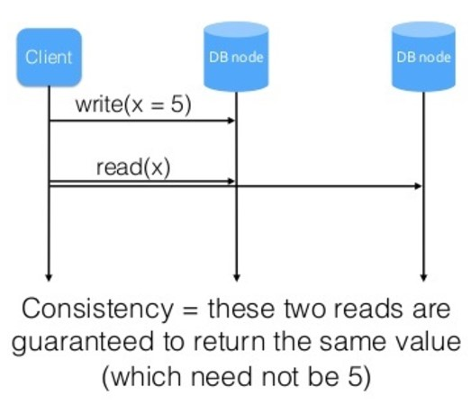

Enlace recomendado:

SQL - NoSQL: [VER](https://www.freecodecamp.org/news/nosql-databases-5f6639ed9574/)

# Práctica en Clase

Instrucciones para la configuración del ambiente
1. sudo apt install -y docker-compose
2. git clone https://github.com/soyHenry/DS-M4-PgAdmin_Postgres
3. cd DS-M4-PgAdmin_Postgres
4. sudo docker-compose up -d
5. sudo docker cp clase-05.sql pgadmin_container:/home/clase-05.sql
6. Conectarse a PgAdmin en “:5050”
7. Agregar un nuevo servidor:
    - Host name/address: postgres
    - Port: 5432
    - Username: postgres
    - Password: changeme

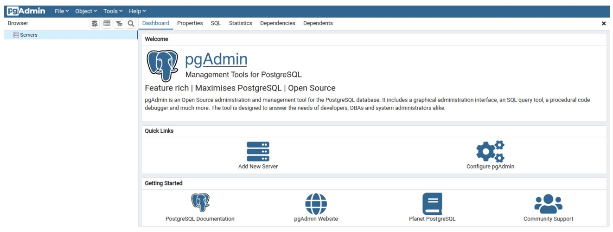
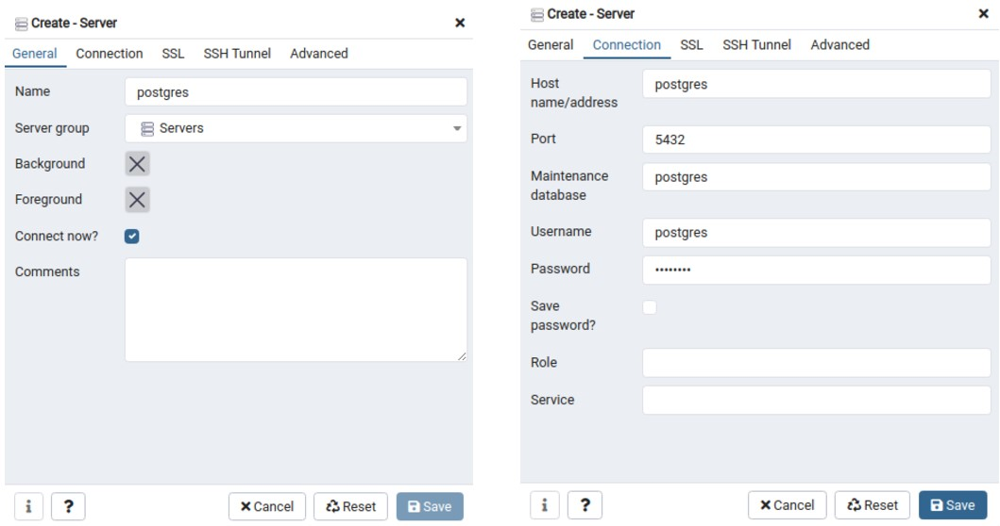
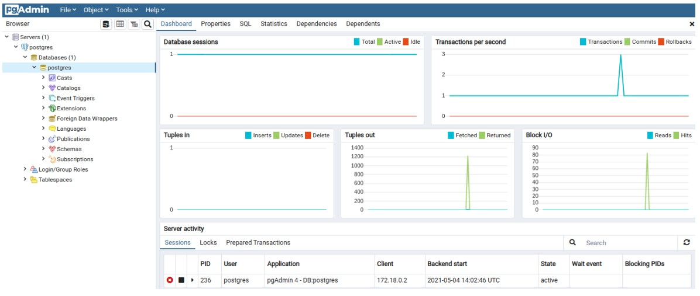
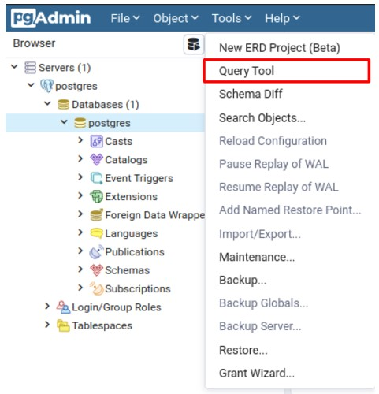
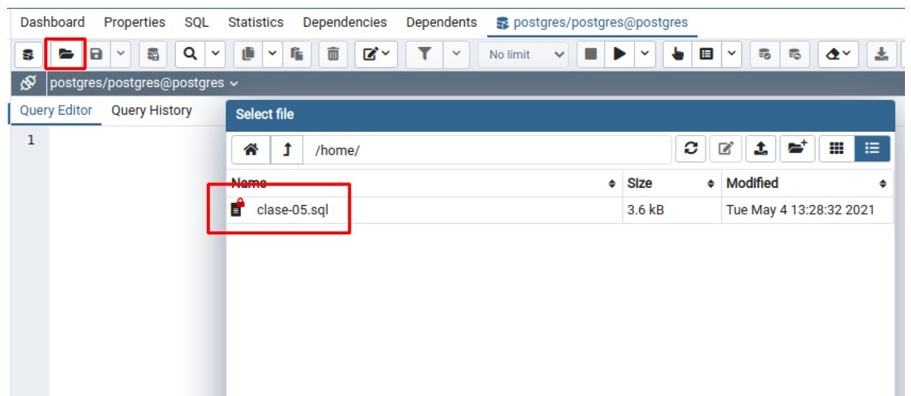

# Notas clase complementaria

# Base de datos SQL
Nace como herramienta para hacer consultas y almacenar tablas relacionadas.

Las tablas tienen formato tabular, tienen diferentes tipos de datos, permite las relaciones (JOINs) y tiene restricciones (PK y FK)

## Integridad
'que los números cuadren' Si hay redundancia, que los números sean coherentes (por ej: si existen dos tablas llamadas 'venta' y 'venta_detalle' y ambas tienen una columna 'monto' que sean coherentes significa que si en el detalle hay tres items correspondientes a una misma venta, que esa suma sea igual al valor hallado en la columna monto de la tabla 'venta')

# Base de datos NoSQL ("Not Only SQL")
en contexto de Big Data, permite organizar gran cantidad de datos heterogéneos, que se logra flexibilizando algunas restricciones de las bases de datos relacionales.
No necesariamente las características de SQL son las mismas que las de NoSQL

## Características:
- caso de uso específicos
- esquema flexible
- Escalabilidad horizontal --> debido a la arquitectura distribuida, se pueden hacer updates agregando nodos, permitiendo mayor capacidad de almacenamiento y mayor capacidad de procesamiento
- no utilizan SQL ni JOINs

# ACID vs BASE.
Son las características que definen los motores de base de datos SQL y NoSQL

## ACID (Atomicidad - Consistencia - Aislamiento - Durabilidad) 
Para entender este concepto es necesario entender el concepto de transacción.
**Transacción:** es una actualización que se le realiza a una tabla. Esta puede ser una INSERSIÓN, un UPDATE o un DELETE, o incluso una combinación de estas.

### Atomicidad
La ejecución de cada transacción es atómica. Se realizan todas las acciones o ninguna.
Esto quiere decir que si en el medio de la transacción (por ejemplo a la mitad de la carga de los datos) ocurre un error, se hace un "roll back", es decir que los cambios que estaban a punto de realizarse, antes de ocurrido el error (siempre en medio de una transacción), se vuelven para atrás,  y se pierde la data, no se hace ninguna acción. Esto es para mantener la **INTEGRIDAD** de los datos. 

### Consistencia
 Las transacciones tienen que estar pensadas de manera que cuadren las tablas.

### Aislamiento (Isolation)
Una transacción no puede afectar a otra.
Por ejemplo si se realiza una consulta (de parte de un analista) en medio de una transacción, la consulta no debe afectar a la transacción, por eso es que deben ser aisladas.
Por lo tanto, la consulta tiene dos opciones: devolver la información hasta antes de la transacción o esperar a que la transacción finalice (dejándome en espera, como analista).

### Durabilidad
Después de que se completa la transacción, se hace un COMMIT, para hacer un guardado seguro de la información.

## BASE (Básicamente disponible - Soft State - COnsistencia evencual)

### Básicamente disponible: 
Garantiza la disponibilidad de los datos, responde a cada solicitud. Esto significa que no te va a dejar en espera, si la consulta (o la nueva transacción), ocurre cuando está en medio de otra transacción. 
Esto significa que puede te va a devolver la data hasta donde está (en medio de la transacción), por lo que puede verse afectada la consistencia, ligeramente.

### Soft State: 
El estado del sistema puede cambiar en el tiempo (consistencia eventual). Por lo explicado anteriormente puede ser que en un momento determinado, haya alguna inconsistencia entre los datos, pero a lo largo del tiempo esa consistencia deseada/requerida, llega.

### Consistencia eventual: 
El sistema eventualmente es consistente una vez que termina de recibir datos, los datos se propagan y el sistema no checkea la consistencia de cada transacción antes de mover a la siguiente. Con este punto hay que tener cuidado.

En SQL, hay ciertas validaciones, por ejemplo, si se hace referencia a un forein key (FK), la primary key (PK) debe existir. En NoSQL, no hay ese tipo de validaciones.

***Preguntas***
*¿Qué significa ACID?* Atomicidad - Consistencia - Aislamiento - Durabilidad

*¿Qué significa BASE?* Básicamente disponible- Soft State - Consistencia eventual.

# Teorema CAP ("Consistency"-"Availability"-"Partition tolerance")
- Un sistema es considerado **consistente** si todas las réplicas contienen el mismo valor.
- Un sistema es considerado **disponible** si los datos están disponibles en todo momento.
- Un sistema tiene tolerancia a **particiones** si el procesamiento puede continuar en ambas particiones en dos o más 'islas'. Un ejemplo, es si está en una arquitectura *"cluster"* (de las que vimos hasta ahora).

> De acuerdo al teorema CAP, no es posible proveer simultáneamente más de dos de las tres propiedades (consistencia, disponibilidad, particionado)
>
>*simultáneamente* --> el momento en el que potencialmente puede ocurrir un fallo, el sistema de base de datos que estemos utilizando (SQL o NoSQL), tiene que priorizar dos de las tres propiedades, no puede priorizar las tres ya que es matemáticamente imposible.

>  

-->*PARTICIÓN:* no se refiere a los índices (por ejemplo de MySQL), sino a tener una arquitectura distribuida, por ejemplo, en nodos (cluster Hadoop). MySQL no tiene arquitectura distribuida (tiene arquitectura cliente-servidor).

*Pregunta*
*¿Cuáles son las tres propiedades que según el teorema CAP no pueden cumplirse simultáneamente?* Consistencia - Disponibilidad - Tolerancia a la partición.
*¿El teorema CAP significa que vamos a perder una de las tres propiedades siempre?* **NO**