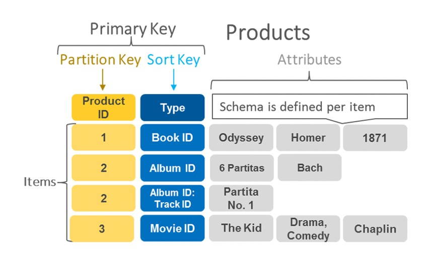

# Tipos de Motores de Bases de Datos NoSQL
1. Bases de datos de Clave-Valor. (“Key-Value Pair Databases”)
2. Base de datos de Documentos. (“Document Databases”)
3. Bases de datos de Familia de Columnas. (“Column-Family Databases”)
4. Bases de datos de Grafos. (“Graph Databases”)

**Algunos ejemplos...**

## DynamoDB
DynamoDB es una base de datos NoSQL (Not only SQL) de tipo clave-valor disponible como servicio en AWS. En DynamoDB las tablas son las colecciones de elementos, y los elementos son colecciones de atributos o pares clave-valor.

La clave primaria de una tabla está compuesta de una clave de partición y de una clave de clasificación (sort key). También, se puede usar un índice secundario global o GSI, que permite realizar consultas filtrando por columnas que no sean la clave de partición o de clasificación.

## HBase
Está compuesto por una serie de tablas que contienen filas y columnas, en forma similar a una base de datos tradicional. Cada tabla consta de una Clave Primaria (“Primary Key”), todo acceso a las tablas es realizado usando la Clave Primaria.

Una columna en Hbase representa un atributo de un objeto. Hbase es diferente a las bases RDBMS en términos de cómo los datos son almacenados. Todos los datos de Hbase se almacenan en archivos HDFS.

## Cassandra
Apache Cassandra es un híbrido entre bases de datos de valores clave y de columnas. Provee una arquitectura escalable, disponibilidad contínua, protección de datos, replicación “multi-data” sobre centros de datos (“data centers”), compresión de datos y un lenguaje “SQL Like”. Su arquitectura es “master-less”, en el cual todos los nodos actúan por igual, comunicándose entre ellos por medio de un protocolo distribuido y escalable llamado Gossip. 

El modelo de datos de Cassandra consiste en filas particionadas que se almacenan en tablas con un nivel de consistencia configurable, indexadas por medio de llaves (“keys”). El modelo Peer-To- Peer, permite que los nodos se relacionen entre sí.

## Neo4J
Neo4j es un software libre de Base de datos orientada a grafos, implementado en Java.

Es un motor de persistencia embebido, basado en disco, implementado en Java, completamente transaccional, que almacena datos estructurados en grafos en lugar de en tablas.

## MongoDB
MongoDB es una base de datos distribuida, basada en documentos y de uso general que ha sido diseñada para desarrolladores de aplicaciones modernas y para la era de la nube. Un registro en MongoDB es un documento, con una estructura de datos compuesta por campo (“field”) y pares de valores (“value pairs”). Los documentos MongoDB son similares a objetos JSON.

**Características:**
- Lenguaje de consultas CRUD.
- Alta performance.
- Alta disponibilidad.
- Escalabilidad horizontal.
- Soporte para diferentes motores de almacenamiento.

**Paper Destacado:**
***DynamoDB***  [LEER](https://www.allthingsdistributed.com/files/amazon-dynamo-sosp2007.pdf)

#### Enlaces de Referencia
**HBase** (https://hbase.apache.org/book.html#_architecture)
**Cassandra** (https://docs.datastax.com/en/dse/6.8/cql/index.html)
**MongoDB** (https://docs.mongodb.com/manual/tutorial/getting-started/)
**DynamoDB** (https://aws.amazon.com/es/getting-started/hands-on/create-nosql-table/)
**Neo4J** (https://neo4j.com/developer/get-started/)
**Drill** (http://drill.apache.org/docs/drill-in-10-minutes/)

# Práctica en Clase
Vamos a utilizar las plataformas online que ofrecen los vendors de soluciones NoSQL.
1. **Neo4J** (https://sandbox.neo4j.com/login)

* Se puede descargar y utilizar Neo4J localmente también, en el archivo "ejemploNeo4J.txt" se pueden ingestar algunas tablas!

2. **Cassandra** (https://astra.datastax.com/register)

* Utilizar el archivo "training.cql" para realizar consultas! 

3. **MongoDB** (https://docs.mongodb.com/manual/tutorial/getting-started/)

