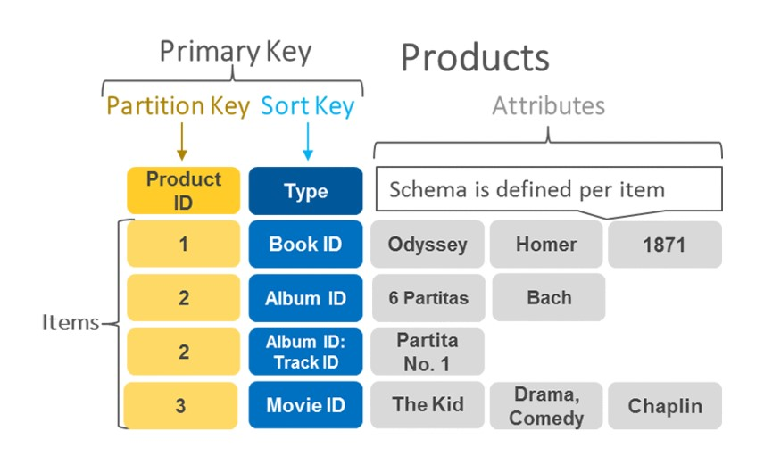
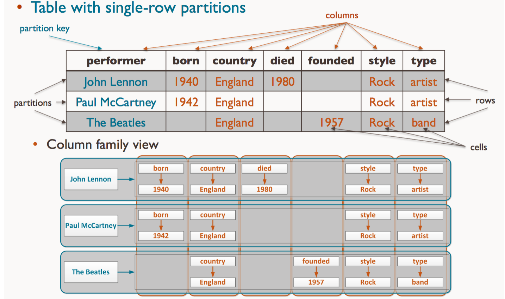
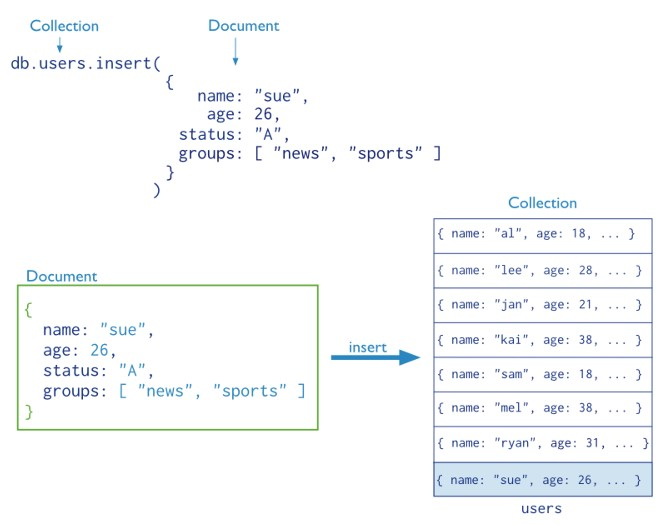

# Motores NoSQL

Tipos de Motores NoSQL

- Bases de datos Clave Valor -> un solo diccionario que es capaz de almacenar todos los datos
- Base de datos de Documentos (especialmente archivos JSONs), a diferencia del anterior, son muchos "diccionarios" (ej. MongoDB)
- Bases de datos de Familia de Columnas ("Column-Family Database")
(HBase)
- Base de datos de grafos --> por un lado está el almacenamiento y por el otro el procesamiento de datos. La base de datos de grafos está más especializada en el almacenamiento de este tipo de dato (grafos) y por lo tanto permite hacer consultas complejas para esto. En una cbase de datos tradicional, no se pueden realizar

# NoSQL
## DynomoDB
Es un servicio disponible en AWS. En DynamoDB las tablas son las colecciones de elementos, y los elementos son colecciones de atributos o pares clave-valor. La clave primaria de una tabla está compuesta de una clave de partición y de una clave de clasificación (sort key).
En este caso tenemos un primary key compuesto por dos componentes: un partition key y una sort key, que me da ciertos atributos. 
El esquema está definido por objetos. El esquema serían las columnas que tenemos, y estas van a ir cambiando para cada fila. 

Esto significa que a pesar de tener todas la información en la misma tabla, en la misma base de datos, nuestro esquema va cambiando. A esto se hace referencia con lo que el esquema está definido por objetos.

Una llave de partición nos permite particionar la data, lo que permite hacer las querys más rápidas y más eficientes, menores costos.

La llave de ordenamiento (clasificación) es el nombre de la tabla, define el esquema

DynamoDB es del tipo clave-valor porque está compuesto por una clave primaria compuesta y toda la información, valor (que está a la derecha de la imagen -en gris-)

## HBase
Está compuesto por una serie de tablas que contienen filas y columnas, en forma similar a una base de datos tradicional. Cada tabla consta de una Clave Primaria("Primary Key"), todo acceso a las tablas es realizado usando la clave primaria.

Lo importante de HBase es que almacena información en formato columnar

Los datos nulos también se guardan en forma eficiente. Con esta base se le saca el mayor provecho al espacio disponible.

Parquet solo sirve para almacenar (lo hace en formato columnar), es solo un archivo.
HBase es un sistema de almacenamiento de base de datos, lo que significa que tiene incorporado cómo almacenar data y lo segundo es como utilizando esa tecnología vamos a hacer querys a la data, extraer data.

HBase es open source, a diferencia de DynamoDB que es de amazon. HBase se puede levantar en cualquier sistema de compus, mientras tenga capacidad de cómputo.

AirFlow también es open source.

## Cassandra
No pertenece al ecosistema Hadoop, sí a la familia Apache.
No funciona sobre HDFS

Es un híbrido entre bases de datos de clave-valor y de columnas-.

El modelo de datos consiste en filas particionadas que se almacenan en tablas con un nivel de consistencia configurable, indexadas por medio de llaves ("keys"). Esencialmente la llave tiene un valor y ese valor está indexado.

El modelo Peer-To-Peer permite que los nodos se relacionen entre sí. No tiene arquitectura de cluster, no existe el concepto de maestro, los nodos no están jerarquizados. Tiene escalabilidad horizontal.

El lenguaje de consultas es **CQL**.

Preguntas: 
*¿Qué motor de bases de datos utiliza DynamoDB?* 
Es clave-valor 
 
*¿Qué motor de bases de datos utiliza Cassandra?* 
Es base de datos de Familia de Columnas, clave-valor. 
 
*¿Qué motor de bases de datos utiliza HBase?* 
Columnar 

## Neo4J
Es una base de datos orientada a grafos, implementado en Java. Es un motor de persistencia embebido, basado en disco, completamente transaccional, que almacena datos estructurados en grados en lugar de en tablas.
Lenguaje de consultas: **Cypher**

Es un tipo de almacenamiento que sirve para almacenar data que tenga algún tipo de relación entre sí.

>Casos/utilidades principales: 
>1. **Problemas de logística** (encontrar la vía más corta). 
>
>2. **Redes sociales**: en Facebook, una de las métricas más importantes es el tiempo en la plataforma. Facebook quiere que estés lo más posible en la plataforma. uno de los factores para enganchar al usuario, es considerar cuántos amigos que tienen en la plataforma los conoce en la vida real, en base a esto, realiza recomendaciones de amistad, posibles conocidos. Lo hace buscando los nodos mas cercanos al que estamos, al analizar el grafo.
>
>3. **Bancos o billeteras virtuales**. Permiten la realización de transferencias de manera gratuita. Esto está financiado por la información que dan este tipo de billeteras virtuales, y los movimientos que hacen los usuarios. La interacción de un usuario no bancarizado con alguien con buen historial crediticio, de manera asidua, hace que el primer usuario tenga un buen historial crediticio (RARIIII)
>
>4. **Análisis de las personas más influyentes de la organización** (principalmente en organizaciones más grandes): Dependiendo de los correos enviados entre personas de una misma organización, se hace un link, un vínculo. A mayor cantidad de correos, mayor es la vinculación.

## MongoDB
MongoDB almacena documentos (archivos JSON). Es una base de datos distribuida, basada en documentos y de uso general que ha sido diseñada para desarrolladores de aplicaciones modernas y para la era de la nube. Un registro en MongoDB es un documento, con una estructura de datos compuesta por campo ("field") y pares de valores ("value pairs"). Los documentos MongoDB son similares a los objetos JSON.
Lenguaje de consultas:**CRUD**

*Preguntas* 
*¿Cómo describiríamos a Neo4J como base de datos?* 
Base de datos de Grafos 
 
*¿Cómo describiríamos a MongoDB como base de datos?* 
de documentos 
