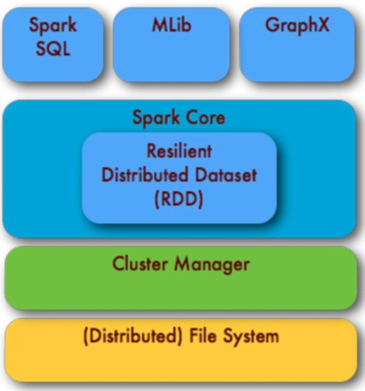
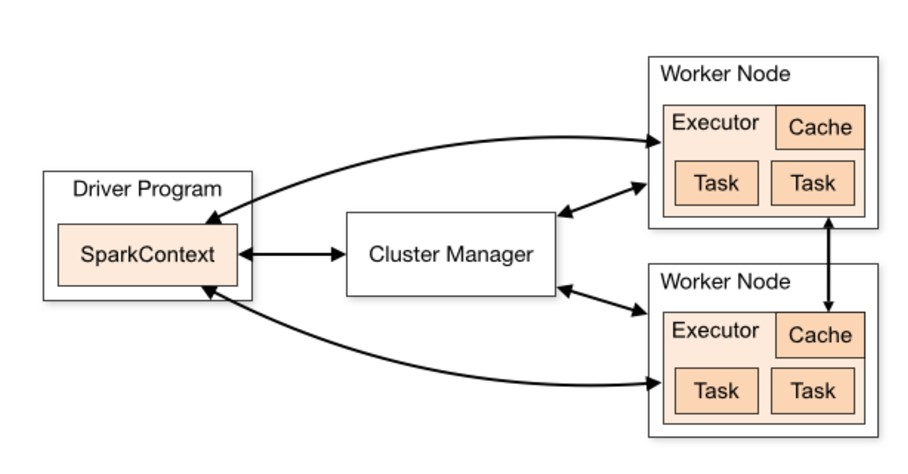
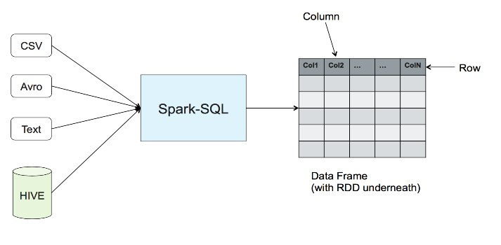
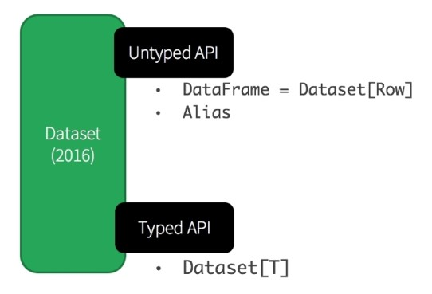
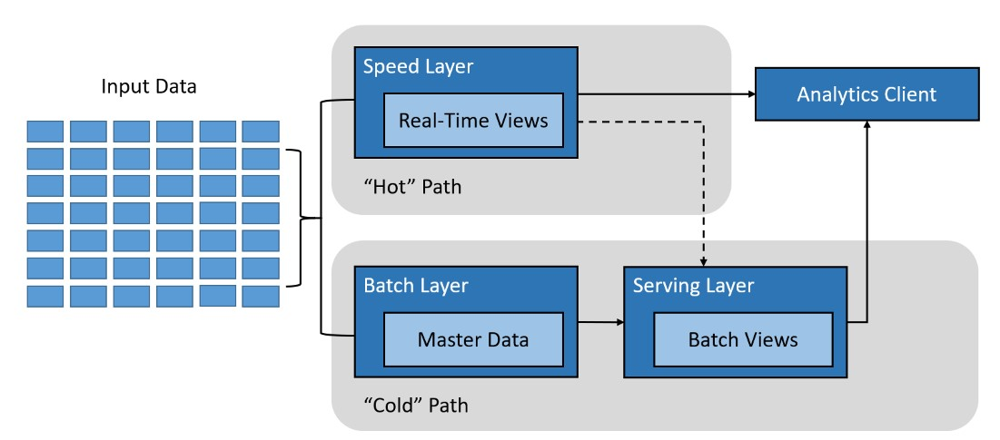

# Apache Spark

Apache Spark es un motor para procesamiento a gran escala de datos, integrado, rápido, "in memory" y de propósito general. Tiene su propio sistema de "Cluster Management" y utiliza Hadoop solo como almacenamiento. Spark está escrito en Scala y provee APIs en Java, Scala, Python y R.

## Características principales:
1. Computación en memoria.
2. Tolerancia a fallos.
3. Multipropósito.

Spark es ideal para tareas de procesamiento iterativo e interactivo de grandes datasets y flujos de datos ("streaming"). Proporciona un rendimiento entre 10-100 veces mayor que Hadoop, operando con "Resilient Distributed Datasets" (RDDs), que evitan latencias en lectura y escritura en discos, siendo una alternativa más eficiente a MapReduce.

Caso Uber: [VER](https://www.slideshare.net/databricks/spark-meetup-at-uber)
Caso Apple: [VER](https://www.slideshare.net/databricks/apache-spark-at-apple-with-sam-maclennan-and-vishwanath-lakkundi)
Caso Netflix: [VER](https://www.slideshare.net/databricks/migrating-to-apache-spark-at-netflix)

## Arquitectura de Spark

Spark tiene una arquitectura de capas bien definida, donde todos los componentes están relacionados e integrados con extensiones y librerías. Está basada en dos abstracciones:
- **RDD (Resilient Distributed Dataset)**: Colección distribuida de objetos que residen en varios nodos del clúster.
- **DAG (Directed Acyclic Graph)**: Grafo dirigido acíclico que describe las etapas de trabajo para ejecutarse en un clúster.

Cada tarea de Spark crea un DAG de etapas de trabajo para que se ejecuten en un determinado cluster. En comparación con MapReduce, el cual crea un DAG con dos estados predefinidos (Map y Reduce), los grafos DAG creados por Spark pueden tener cualquier número de etapas Spark con DAG es más rápido que MapReduce por el hecho de que no tiene que escribir en disco los resultados obtenidos en las etapas intermedias del grafo. Gracias a una completa API, es posible programar complejos hilos de ejecución paralelos en unas pocas líneas de código.

Es un grafo dirigido que no tiene ciclos, es decir, para cada nodo del grafo no hay un camino directo que comience y finalice en dicho nodo. Un vértice se conecta a otro, pero nunca a sí mismo; para cada vértice v, no hay un camino directo que empiece y termine en V. Spark soporta el flujo de datos acíclico.

## Comparación: Spark vs Hadoop

| **Características**       | **Hadoop**                                                                             | **Spark**                                                                         |
|---------------------------|---------------------------------------------------------------------------------------|----------------------------------------------------------------------------------|
| **Propósito**              | Procesamiento y almacenamiento de grandes datasets                                     | Motor de propósito general para procesamiento de datos a gran escala              |
| **Componentes principales**| Hadoop Distributed File Systems                                                        | Spark Core, motor de procesamiento en memoria                                    |
| **Almacenamiento**         | HDFS administra colecciones de datos a través de nodos en un clúster                   | Spark no realiza almacenamiento distribuido, trabaja con colecciones de datos     |
| **Tolerancia a fallos**    | Replicación: los datos son escritos en discos en varios nodos                          | RDD minimiza “network I/O”. Los RDD pueden ser reconstruidos ante fallos          |
| **Velocidad de procesamiento** | MapReduce es más lento                                                              | Hasta 10x más rápido que MapReduce para "batch processing" y hasta 100x más rápido en "streaming" |
| **Soporte de lenguajes**   | Java                                                                                   | Scala, APIs para Python, Java, R y otros                                         |

## RDD (Resilient Distributed Dataset)

Los RDD son la estructura de datos fundamental en Spark. Son una colección distribuida de objetos que residen en diferentes nodos del clúster. Los RDD son:
- **Resilientes**: Pueden recuperarse ante fallos, ya que se replican en varios nodos.
- **Distribuidos**: Los datos se dividen en varios nodos del clúster.
- **Dataset**: Representan registros de datos que pueden ser cargados desde JSON, CSV, texto o bases de datos por medio de JDBC.

Todas las aplicaciones en Spark tienen un controlador central (Driver) y varios ejecutores que realizan las tareas en paralelo.

### Operaciones sobre RDD

Los RDD soportan dos tipos de operaciones:
1. **Transformaciones**: Permiten crear nuevos RDD a partir de otros (ej. `map`, `filter`).
2. **Acciones**: Devuelven un valor al driver (ej. `reduce`).

Spark usa la ejecución "lazy" (perezosa), lo que significa que las transformaciones se calculan solo cuando se invoca una acción. Una ventaja de los RDD es que la ejecución perezosa permite detectar errores antes de que se ejecuten.

## DataFrames

Un DataFrame es una colección de RDD con un esquema. Características:
- Los datos están organizados en columnas nombradas, como una tabla en una base de datos relacional.
- Se introdujeron en la versión 1.3 de Spark y son invocados con Spark SQL.

### Catalyst Optimizer

Catalyst es el motor de optimización de Spark, que reordena las transformaciones de manera óptima, sin alterar los resultados. Además, utiliza Tungsten para mejorar la eficiencia de memoria y CPU, logrando un procesamiento más rápido.

## Datasets

Un Dataset es una extensión de los DataFrames. Características:
- Clases fuertemente tipadas.
- Verificación de tipos de datos en tiempo de compilación.
- Disponible solo en Scala y Java.

## Módulos de Spark

### Spark Core

Es el corazón de Spark que brinda capacidades de procesamiento "in-memory". Es la base para el procesamiento distribuido de grandes datasets.

### Spark SQL

Es un módulo que permite trabajar con datos estructurados y realizar consultas SQL sobre estos datos, interactuando con diversas fuentes que pueden representarse de forma tabular.

### Spark Streaming

Permite el procesamiento de flujos de datos en tiempo real, utilizando micro-batches. Pueden operar con varias fuentes de datos como Kafka, Flume, y TCP Sockets.

### Spark MLlib

Es la biblioteca de Machine Learning de Spark. Contiene herramientas para clustering, regresión, y filtrado colaborativo, entre otros.

### Spark GraphX

Un motor de análisis de grafos que extiende los RDD y permite trabajar con grafos dirigidos.

## Procesamiento Batch y Streaming

### Procesamiento Batch

Se refiere al procesamiento de grandes volúmenes de datos en lotes, por ejemplo, un informe anual de ventas.

### Procesamiento Streaming

Se refiere al procesamiento de datos en tiempo real, por ejemplo, eventos de sensores o clics en un sitio web.

## Arquitectura Lambda

La Arquitectura Lambda combina el procesamiento Batch y Streaming para crear un sistema robusto que maneje datos en tiempo real y datos históricos de manera eficiente.

## Kafka

Kafka es un sistema de mensajería distribuido que sigue el patrón productor-consumidor. Los mensajes se organizan en **topics** y pueden ser producidos y consumidos en tiempo real.

## Spark Streaming

Spark Streaming es el módulo de Spark que permite procesar flujos de datos continuos, utilizando micro-batching. Fuentes de datos incluyen Kafka, Flume, y Twitter.

---

> **Dato curioso**: Apache Spark fue desarrollado en la Universidad de California, Berkeley, en el 2009, como un proyecto de investigación denominado AMPLab, para diseñar una plataforma de computación en clusters capaz de procesar grandes volúmenes de datos rápidamente.
