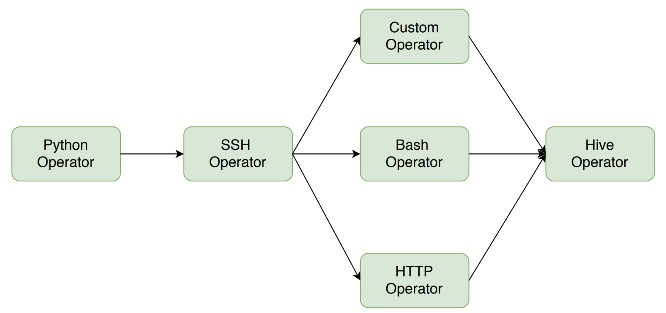
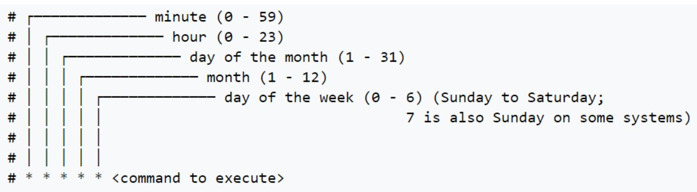
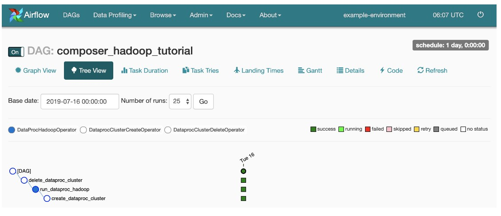

# Flujos de trabajo
Un proyecto de Big Data implica realizar múltiples tareas en diferentes sistemas en un orden específico. Es por este motivo que existe la necesidad de contar con orquestadores de flujos de trabajo que permitan automatizar el movimiento y la transformación de los datos.

Que las múltiples tareas se realizan en diferentes sistemas significa que por ejemplo un primer componente es un ETL que se realiza en Python, un segundo componente de SCH, un operador específico, un bash, un http, etc., y al final algún comando Hive
En este caso es necesario conectar los diferentes componentes. Primero determinar un orden lógico de las tareas/pasos a realizar, 2do lograr automatizarlo en un determinado horario. 3ro tener registro de la ejecución, si hay errores, etc., tenerlos guardados en algún archivo. 4ta a mayor tamaño de organización mayor cantidad de flujos de trabajo, que deben ser organizados.

# DAG
¿Cómo se organizan las tareas? ***No pueden tener un orden aleatorio***
**Directed Acyclic Graph** Es una representación conceptual de una serie de actividades.
- **Dirigido**: cada relación entre nodos tiene un sentido único. Hay una cierta dirección. Una tarea compleja se divide en varias tareas más simples y cada una de esas tareas va a esta unida en un orden lógico.
- **Acíclico**: no hay ningún camino que nos permita volver al nodo inicial.

# Notación CRON
En el sistema operativo Unix, cron es un administrador regular de procesos en segundo plano (demonio) que ejecuta procesos o guiones a intervalos regulares (por ejemplo, cada minuto, día, semana o mes). Los procesos que deben ejecutarse y la hora en la que deben hacerlo se especifican en el fichero crontab. Como usuario podemos agregar comandos o scripts con tareas a cron para automatizar algunos procesos.

Es una forma de cómo especificar a qué hora vamos a correr cierto código (cinco asteriscos: minuto, hora, día-mes-, mes, día-semana-).

Sirve para automatizar tareas sencillas. 

# Oozie (casi no se usa)
- Es un sistema de programación de workflows incluido en distribuciones de Hadoop.
- Los flujos de trabajo en Oozie están definidos como una colección de tareas representadas en un DAG.
- Acciones soportadas: MapReduce, Shell, Pig, Hive, Spark, Java, entre otros.

Aparece en Hue, está dentro del ecosistema de Hadoop, por lo que es una limitante si quiero trabajar con herramientas fuera de este ecosistema (tecnología cloud)

# Nifi
- Es una herramienta desarrollada por la NSA que permite automatizar flujos de datos entre sistemas.
- Posee una interfaz web que permite crear flujos sin necesidad de escribir código (no-code o low-code) (Drag and drop--> permite ejecutar algún código en un archivo).
- Brinda funcionalidades de seguridad, monitoreo y linaje de datos en movimiento.
- No permite la flexibilidad "infinita" de Python, pero para tareas sencillas andan bien.

# Airflow
- Es una plataforma de gestión de flujos de trabajo de código abierto desarrollada por Airbnb.
- Las tareas y dependencias se representan como DAG's definidos en scripts de Python.
- los DAG's pueden ser programados para ejecutarse en un horario predefinido o en función de la ocurrencia de eventos.

Cómo nace Airflow?
en un contexto donde ya existían algunos orquestadores (tipo Luiggi), sin embargo no existía una herramienta que conjugue todas las herramientas hasta acá vistas(que me permita logearme a ciertos sistemas, la capacidad de automatización, que no sea drag and drop, sino que sea tan flexible como para escribir código, que podamos administrar las distintas tareas, de organizarlas para que posteriormente podamos encontrarlas fácilmente). 
Nace para poder orquestar los distintos procesos que se suceden dentro de Airbnb.
Nace en un momento en el que aún no había un rl de data engineer. 
Lo hacen de código abierto y que pueda unirse a Apache.
